<!--
  <copyright file="AGENT_REGISTRY_INSTALLATION_GUIDE.md" company="Cloud Software Group, Inc.">
    Copyright (c) 2006 - 2026 Cloud Software Group, Inc.
  All rights reserved.
  This software is the confidential and proprietary information
  of Cloud Software Group, Inc. ("Confidential Information"). You shall not
  disclose such Confidential Information and may not use it in any way,
  absent an express written license agreement between you and
  Cloud Software Group, Inc. that authorizes such use.
  </copyright>
-->

# Spotfire Copilot™ — Agent Registry Installation Guide

> **Version:** `1.1.0` &nbsp;|&nbsp; **Last updated:** 22 June 2026 &nbsp;|&nbsp; **Applies to:** Agent Registry Container
>
> The **Agent Registry** is a Docker container that hosts one or more A2A (Agent-to-Agent) agents on a single port and exposes them for registration with the Spotfire Copilot™ orchestrator. In development mode it also enables optional tools (MCP server, WebSocket reverse tunnel, type-stub generator) for building custom agents locally.
>
> This guide covers two audiences:
>
> - **Spotfire administrators** deploying the Agent Registry to a cloud platform (Azure, GCP, AWS, or Kubernetes) or on-premise so that agents are reachable from a deployed orchestrator.
> - **Spotfire developers** running the Agent Registry locally on their workstation to build, test, and tunnel custom agents into a deployed orchestrator without opening any inbound ports.
>
> The Agent Registry depends on a deployed Spotfire Copilot™ orchestrator. If you have not yet installed the orchestrator, see the [Spotfire Copilot™ Installation Guide (Backend)](../Spotfire%20Copilot%20Backend%20Services/Spotfire%20Copilot%20-%20Installation%20Guide%20-%20Backend%20Setup.md) first.

---

## Table of Contents

- [What's New in 1.1.0](#whats-new-in-110)
- [1. Introduction](#1-introduction)
  - [1.1 What You Are Deploying](#11-what-you-are-deploying)
  - [1.2 Architecture Overview](#12-architecture-overview)
  - [Health Check Endpoints](#health-check-endpoints)
  - [Pulling the Docker Image](#pulling-the-docker-image)
  - [1.3 Prerequisites](#13-prerequisites)
  - [1.4 Recommended Personnel](#14-recommended-personnel)
- [2. Choose Your Deployment Path](#2-choose-your-deployment-path)
  - [Where will you run the Agent Registry?](#where-will-you-run-the-agent-registry)
- [3. Step 1 — Generate Credentials](#3-step-1--generate-credentials)
  - [Local Container Credentials](#local-container-credentials)
  - [Orchestrator OAuth2 Client](#orchestrator-oauth2-client)
- [4. Step 2 — Configure the Orchestrator Connection](#4-step-2--configure-the-orchestrator-connection)
  - [HTTP Direct (Production)](#http-direct-production)
  - [WebSocket Tunnel (Local Development)](#websocket-tunnel-local-development)
- [5. Step 3 — Deploy](#5-step-3--deploy)
  - [Managing Environment Variables in the Cloud](#managing-environment-variables-in-the-cloud)
  - [5.1 Local Development (Docker Desktop)](#51-local-development-docker-desktop)
  - [5.2 Azure Container Apps](#52-azure-container-apps)
  - [5.3 GCP Cloud Run](#53-gcp-cloud-run)
  - [5.4 AWS (ECS / Fargate)](#54-aws-ecs--fargate)
  - [5.5 Kubernetes](#55-kubernetes)
  - [5.6 On-Premise (Docker Compose)](#56-on-premise-docker-compose)
- [6. Step 4 — Verify and Register Agents](#6-step-4--verify-and-register-agents)
  - [Health checks](#health-checks)
  - [Confirm agent cards are published](#confirm-agent-cards-are-published)
  - [Register an agent in the orchestrator](#register-an-agent-in-the-orchestrator)
- [7. Step 5 — Set Up the Local Agent Workspace (Developers)](#7-step-5--set-up-the-local-agent-workspace-developers)
  - [Workspace Layout](#workspace-layout)
  - [Type Stubs for IDE Autocomplete](#type-stubs-for-ide-autocomplete)
  - [Enabling the MCP Development Server](#enabling-the-mcp-development-server)
  - [Hot-Reload Behaviour](#hot-reload-behaviour)
- [8. Authentication Reference](#8-authentication-reference)
  - [Flow 1 — Spotfire / orchestrator → Agent Registry](#flow-1--spotfire--orchestrator--agent-registry)
  - [Flow 2 — Agent Registry → Orchestrator](#flow-2--agent-registry--orchestrator)
- [9. Environment Variable Reference](#9-environment-variable-reference)
  - [Required variables (container will not start or operate without these)](#required-variables-container-will-not-start-or-operate-without-these)
  - [Server variables](#server-variables)
  - [Custom agent variables](#custom-agent-variables)
  - [Development variables](#development-variables)
  - [Tunnel variables](#tunnel-variables)
- [10. Troubleshooting](#10-troubleshooting)
  - [Authentication errors](#authentication-errors)
  - [Container startup issues](#container-startup-issues)
  - [Local development issues](#local-development-issues)
  - [Orchestrator connectivity](#orchestrator-connectivity)
  - [Useful diagnostic commands](#useful-diagnostic-commands)
- [11. Security Best Practices](#11-security-best-practices)
  - [Disable development features in production](#disable-development-features-in-production)
  - [Credential management](#credential-management)
  - [Network security](#network-security)
  - [Container security](#container-security)
  - [Audit and monitoring](#audit-and-monitoring)

---

## What's New in 1.1.0

- **MCP development server now requires VS Code 1.109 or later.** The MCP Apps UI surface (design form, welcome screens, interactive components) was updated for the stable MCP Apps protocol shipped in VS Code 1.109. Earlier VS Code builds will not render the rich UI; upgrade VS Code before running `MCP_ENABLED=true`. See [section 7](#7-step-5--set-up-the-local-agent-workspace-developers), *Enabling the MCP Development Server*.
- **Toolkit marking fixes.** Reworked the `mark_rows_*` operations and helpers for reliable round-tripping with Spotfire:
  - `mark_rows_ops_from_tuples` is now the single supported public API for batched marking and emits one op per batch with a fixed batch size of 100 rows.
  - The lower-level helper is now private; a new `MarkingBatchError` surfaces partial failures instead of silently dropping rows.
  - Updated scaffolding templates and the `viz-data-shaping` skill to recommend the new API.
- **Agent stability fixes.**
  - The registry no longer silently demotes a failing code agent to a no-code stub — failures are reported and the agent is taken out of rotation.
  - Remove → re-add cycles on the in-process file watcher no longer leave stale Starlette mounts or executors behind.
  - A new in-process file watcher hot-reloads custom workflows without dropping the MCP connection.
- **Tracing and monitoring improvements.**
  - Per-conversation log files now include an executor diagnostic block on every turn, making it easier to correlate orchestrator requests with stage execution.
  - The dry-run harness (`dry_run_agent`) prepends an unmissable PASS / PASS-PARTIAL / FAIL banner above its JSON report.
- **Spotfire marking topology guidance** added to the `viz-data-shaping` and `marked-data` skills, covering semantic column mapping and viz property paths.

---

## 1. Introduction

### 1.1 What You Are Deploying

The Agent Registry is a **single Docker container** that serves one or more Spotfire Copilot™ agents over the [A2A protocol](https://github.com/a2aproject/a2a-samples). A single image plays two roles:

- **In production**, it hosts a fixed set of bundled agents plus any custom agents mounted at `CUSTOM_WORKFLOWS_DIR`, behind OAuth2 bearer-token authentication. A deployed orchestrator calls it directly over HTTP after an administrator registers each agent in the orchestrator's admin console.
- **In development**, the same image runs on a developer's laptop with development features enabled. Hot-reload, type-stub generation, the MCP development server, and a WebSocket reverse tunnel into a deployed orchestrator allow agent code to be written, validated, and tested end-to-end against the orchestrator without opening any inbound ports.

The container provides:

- **Multi-agent hosting** — each agent is served at `/agents/<slug>/` and auto-publishes its agent card at `<endpoint>/.well-known/agent-card.json`
- **OAuth2 client-credentials authentication** — a `/token` endpoint issues short-lived JWTs that protect every agent endpoint
- **Auto-discovery** — bundled agents and any custom agents mounted at `CUSTOM_WORKFLOWS_DIR` are discovered at startup and on file change
- **Orchestrator relay** — outbound LLM calls and RAG retrieval are proxied to the orchestrator using a single configured OAuth2 client, so agents do not hold their own LLM credentials
- **WebSocket reverse tunnel** *(development only)* — registers locally-running agents with a deployed orchestrator without inbound ports
- **MCP development server** *(development only)* — exposes scaffolding, dry-run, and read-skill tools to AI coding assistants over the Model Context Protocol
- **Shared visualization capabilities** — well-log, standard, and advanced visualization helpers are available to every agent

> **The MCP server and tunnel are development-only features.** Both are disabled unless you explicitly opt in, and must remain disabled in production deployments. See [section 11](#11-security-best-practices), *Security Best Practices*.

### 1.2 Architecture Overview

The Agent Registry runs as **one container** from a single Docker image. There is no database to provision and no separate admin console — registration state lives in the orchestrator.

| Container | Default Port | Image (`1.1.0`) | Required? | Role |
|---|---|---|---|---|
| **Agent Registry** | `8050` | `copilotoci.azurecr.io/spotfirecopilot/agent-container:1.1.0` | **Yes** | Hosts agents, issues bearer tokens, relays LLM calls to the orchestrator |
| **Orchestrator** | `8080` | `copilotoci.azurecr.io/spotfirecopilot/llm-orchestrator:2.3.4` | **Yes** *(separate install)* | LLM orchestration, thread management, agent registration. Compatible with orchestrator `2.3.1` and later; `2.3.4` is the latest. |

> **One image, two deployment shapes.** The same image binary serves production and development. Production deployments run the image with its default startup command and minimal environment. Local development sets `MCP_ENABLED=true` and `TUNNEL_ENABLED=true` and bind-mounts a custom-agents directory; nothing about the image itself changes.

```mermaid
graph TB
    subgraph PROD ["🏭 PRODUCTION MODE (HTTP Direct)"]
        Client["Spotfire Client"]
        Orch["Orchestrator<br/>:8080<br/>(LLM gateway)"]
        PG[("PostgreSQL")]
        Agents["Agent Registry<br/>:8050<br/>(cloud/on-premise)"]
        
        Client -->|REST API<br/>Bearer Token| Orch
        Orch -->|fetch agent<br/>card & call| Agents
        Agents -->|LLM relay + RAG<br/>OAuth2 client credentials| Orch
        Orch --- PG
        
        style Agents fill:#fce8e6,stroke:#d93025,stroke-width:2px
        style Orch fill:#e8f0fe,stroke:#1a73e8
        style Client fill:#fff,stroke:#5f6368
        style PG fill:#e6f4ea,stroke:#1e8e3e
    end
    
    subgraph DEV ["💻 DEVELOPMENT MODE (WebSocket Tunnel)"]
        Dev["Developer Workstation<br/>VS Code + Docker Desktop"]
        LocalReg["Local Agent Registry<br/>:8050<br/>(on your laptop)"]
        Orch2["Orchestrator<br/>:8080<br/>(remote, LLM gateway)"]
        
        Dev -->|edit agents| LocalReg
        LocalReg -->|outbound WSS<br/>persistent connection| Orch2
        Orch2 -.->|routes requests<br/>back over WSS| LocalReg
        LocalReg -->|LLM relay + RAG<br/>OAuth2 client credentials| Orch2
        
        style Dev fill:#fff,stroke:#5f6368,stroke-width:2px
        style LocalReg fill:#fce8e6,stroke:#d93025,stroke-width:2px
        style Orch2 fill:#e8f0fe,stroke:#1a73e8
    end
    
    NOTE["<b>Key points:</b><br/>PRODUCTION: Orchestrator pulls agent requests from the Agent Registry<br/>DEVELOPMENT: Agent Registry pushes a tunnel out to the Orchestrator (no firewall needed)<br/>BOTH MODES: Agents never hold LLM credentials — every LLM call and RAG query is relayed through the Orchestrator"]
    
    style NOTE fill:#fef7e0,stroke:#f9ab00,stroke-width:2px
```



**Production (HTTP Direct):** The orchestrator makes direct HTTP calls to the Agent Registry. Requires inbound firewall rules to allow the orchestrator to reach the registry's `BASE_URL`.

**Development (WebSocket Tunnel):** A local Agent Registry opens an outbound WebSocket to the orchestrator's `/tunnel/connect` endpoint and registers its agents. The orchestrator proxies requests back over the same tunnel. No inbound ports or firewall changes required — the connection is always initiated by the registry. Tunneled agents are scoped to the developer's Spotfire user ID and appear only in that user's Copilot session.

**LLM access (both modes):** Agents never hold their own LLM credentials. Whenever an agent needs to call an LLM or query the RAG vector store, the Agent Registry relays the request to the orchestrator using a single OAuth2 client (`ORCHESTRATOR_CLIENT_ID` / `ORCHESTRATOR_CLIENT_SECRET`). The orchestrator authenticates the registry, forwards the call to the configured model provider, and returns the response. This keeps all model-provider credentials and quotas centralised in the orchestrator.

Both modes use the **same OAuth2 client credentials** to authenticate the Agent Registry to the orchestrator. The tunnel requires that client to hold the `agents:write` scope (granted automatically by the `agent_developer` scope profile — see *Orchestrator OAuth2 Client* in [section 3](#3-step-1--generate-credentials)).

### Health Check Endpoints

> **⚠️ The Agent Registry exposes two distinct health endpoints.** Using the wrong one in your platform's probe configuration will cause restart loops.

| Container | Liveness Path | Readiness Path | Port | Method | Expected Response |
|---|---|---|---|---|---|
| **Agent Registry** | **`/healthz`** | **`/readyz`** | 8050 | `GET` | `200 OK` with `{"status":"ok"}` |

```bash
# Liveness — is the process up?
curl -f http://localhost:8050/healthz

# Readiness — are agents discovered and ready?
curl -f http://localhost:8050/readyz
```

**Platform-specific configuration:**

| Platform | Liveness | Readiness |
|---|---|---|
| **Docker Compose** | `curl -f http://localhost:8050/healthz` | `curl -f http://localhost:8050/readyz` |
| **Kubernetes** | `httpGet` → path: `/healthz`, port: `8050` | `httpGet` → path: `/readyz`, port: `8050` |
| **AWS ECS** | `CMD-SHELL curl -f http://localhost:8050/healthz \|\| exit 1` | n/a (use the same) |
| **Azure Container Apps** | Liveness probe → path: `/healthz`, port: `8050` | Startup probe → path: `/readyz`, port: `8050` |
| **GCP Cloud Run** | Startup probe → path: `/readyz`, port: `8050` | Liveness probe → path: `/healthz`, port: `8050` |

> **Do not point health probes at `/` or at any `/agents/...` path.** The root path returns 404; the agent endpoints require a bearer token and will return 401. Either will be treated as a failure and the container will be restarted in a loop.

### Pulling the Docker Image

The Agent Registry is distributed exclusively via the **Azure Container Registry** at `copilotoci.azurecr.io`. There is no public ECR mirror — credentials are required for every environment that pulls the image.

| Distribution | Registry | Authentication | Reference |
|---|---|---|---|
| **All versions** | `copilotoci.azurecr.io/spotfirecopilot/` (Azure Container Registry) | **Required** — credentials issued by Spotfire Support | [OCI Registry Access Guide](https://community.spotfire.com/articles/spotfire/oci-registry-access-guide/) |

#### Obtain registry credentials and pull

1. **Request access.** Open a case via the [Spotfire Support Portal](https://support.tibco.com) selecting **Spotfire Enterprise** as the Product and request access to the Spotfire Copilot OCI registry. Support will issue a registry username and password/token. The same credentials grant access to the orchestrator image, the Agent Registry image, and any data-loader images.
2. **Log in to the registry** on every host that will pull the image (developer workstations, CI runners, and production hosts):
   ```bash
   docker login copilotoci.azurecr.io
   # Helm-based deployments:
   helm registry login copilotoci.azurecr.io
   ```
3. **Pull the image:**
   ```bash
   docker pull copilotoci.azurecr.io/spotfirecopilot/agent-container:1.1.0
   ```

For login command details, version policy, troubleshooting registry auth errors, and the complete artifact catalog, consult the [OCI Registry Access Guide](https://community.spotfire.com/articles/spotfire/oci-registry-access-guide/).

> **Cloud and Kubernetes deployments:** create an image-pull secret using your registry credentials and reference it from your deployment manifest. For example, on Kubernetes:
> ```bash
> kubectl create secret docker-registry copilotoci-pull \
>   --docker-server=copilotoci.azurecr.io \
>   --docker-username='<registry-username>' \
>   --docker-password='<registry-password-or-token>'
> ```
> Then add `imagePullSecrets: [{ name: copilotoci-pull }]` to each deployment that pulls from `copilotoci.azurecr.io`. AWS ECS, Azure Container Apps, and GCP Cloud Run have equivalent registry-credential mechanisms — see the platform-specific subsections in [section 5](#5-step-3--deploy).

#### Air-gapped / private registry mirroring

If your deployment environment cannot reach the upstream registry, pull on an internet-connected machine, retag, and push to your internal registry:

```bash
docker login copilotoci.azurecr.io
docker pull copilotoci.azurecr.io/spotfirecopilot/agent-container:1.1.0
docker tag  copilotoci.azurecr.io/spotfirecopilot/agent-container:1.1.0 \
            your-registry.example.com/agent-container:1.1.0
docker push your-registry.example.com/agent-container:1.1.0
```

Update all deployment manifests and compose files to reference your internal registry URL.

### 1.3 Prerequisites

Before you begin, ensure you have:

| Requirement | Details |
|---|---|
| **Spotfire Copilot™ orchestrator** | A reachable orchestrator at `http://<host>:8080` (or your TLS endpoint). The Agent Registry cannot operate without one. |
| **OCI registry credentials** | Issued by Spotfire Support — see *Pulling the Docker Image* in [section 1](#1-get-the-wheel-into-your-workspace). |
| **Cloud platform account** *(production)* | An active account on Azure, GCP, or AWS, plus the corresponding CLI (`az`, `gcloud`, `aws`). |
| **Docker** *(local development and on-premise)* | Docker Engine 20.10+ with Docker Compose V2. Docker Desktop on Windows/macOS is fine. |
| **Network reachability** | The orchestrator must be able to reach the Agent Registry on `BASE_URL` (HTTP Direct mode), **or** the Agent Registry must be able to open an outbound WebSocket to the orchestrator (tunnel mode). |
| **Python 3.11+** | Needed **only** on the machine where you generate local container credentials (Step 1). |
| **VS Code 1.109+ with GitHub Copilot** *(developers, optional)* | Required to use the MCP development server. The MCP Apps UI (design form, welcome screens, interactive components) targets the stable MCP Apps protocol shipped in VS Code 1.109; older builds will not render the rich UI. |

### 1.4 Recommended Personnel

For **production deployments**, an **IT / Analytics Engineer** familiar with:

- Deploying containerized applications to at least one cloud platform (Azure Container Apps, GCP Cloud Run, AWS ECS/Fargate, or Kubernetes)
- Managing environment variables, secrets, and image-pull credentials via the platform's native secrets store
- Configuring health probes, ingress, and TLS termination
- Working with OAuth2 client credentials and bearer-token authentication

For **local agent development**, a **Spotfire developer** familiar with:

- Docker Desktop and Docker Compose
- Python 3.11+ and `uv` (for the type-stubs virtual environment)
- VS Code and GitHub Copilot (for the MCP development server)
- The conceptual structure of an A2A agent — see the Spotfire A2A Agents Guide

---

## 2. Choose Your Deployment Path

The Agent Registry supports the same set of deployment targets as the orchestrator, plus a first-class **local development** path. Identify your scenario first:

### Where will you run the Agent Registry?

| | Cloud Managed Service *(production)* | On-Premise *(production)* | Local Workstation *(development)* |
|---|---|---|---|
| **What** | Azure Container Apps, GCP Cloud Run, AWS ECS/Fargate, or Kubernetes (AKS / GKE / EKS) | Docker Compose on your own server | Docker Desktop on a developer laptop |
| **Connection mode** | HTTP Direct (orchestrator → registry) | HTTP Direct (orchestrator → registry) | WebSocket tunnel (registry → orchestrator) |
| **Inbound ports needed** | Yes — orchestrator must reach `BASE_URL` | Yes — orchestrator must reach `BASE_URL` | **No** — outbound only |
| **Hot-reload** | No | No | Yes (custom-agents directory bind-mounted) |
| **MCP server** | **Disabled** (security) | **Disabled** (security) | Optional, controlled by `MCP_ENABLED=true` |
| **Custom agents** | Mounted via cloud volume at `CUSTOM_WORKFLOWS_DIR` | Mounted from a host directory | Mounted from a host directory (typically your editor workspace) |
| **Audience** | Spotfire administrators | Spotfire administrators | Spotfire developers |

> **All paths share Steps 1–2.** Credentials and orchestrator wiring work the same way. The differences begin in Step 3, where the deployment mechanism and runtime profile diverge.

---

## 3. Step 1 — Generate Credentials

> **Applies to:** All deployments.

The Agent Registry uses two independent sets of OAuth2 client credentials:

1. **Local container credentials** (`AUTH_*`) — used by Spotfire clients and the orchestrator to authenticate against the Agent Registry's own `/token` endpoint when calling its agents.
2. **Orchestrator OAuth2 client** (`ORCHESTRATOR_*`) — used by the Agent Registry to authenticate **outbound** calls to the orchestrator (LLM relay, RAG, agent registration, and the tunnel).

Generate both before deploying.

### Local Container Credentials

The Agent Registry itself does not ship a credential generator — the same `generate_credentials.py` helper that produces orchestrator credentials, distributed with **Spotfire Copilot™**, also produces all three values needed here. Run it once and copy the outputs into your Agent Registry environment:

```bash
# Run the helper from your Spotfire Copilot install
python generate_credentials.py
```

This outputs three values for the Agent Registry:

1. **`AUTH_CLIENT_ID`** — a short, opaque client identifier
2. **`AUTH_CLIENT_SECRET`** — a randomly generated secret (shown only once)
3. **`AUTH_SIGNING_KEY`** — a URL-safe random key used to sign issued JWTs

> **Save the plaintext secret immediately** — `AUTH_CLIENT_SECRET` is shown only once. For on-premise and local development, paste it into your `.env` file. For cloud deployments, store it in your platform's secrets manager (Azure Key Vault, GCP Secret Manager, AWS Secrets Manager, or Kubernetes Secrets) and reference it from your deployment manifest.

If you do not have access to the helper, generate the three values manually with any Python 3.11+ interpreter:

```bash
# AUTH_CLIENT_ID — any short identifier
echo "agent-registry-$(date +%s)"

# AUTH_CLIENT_SECRET — a 32-byte URL-safe random string
python -c "import secrets; print(secrets.token_urlsafe(32))"

# AUTH_SIGNING_KEY — a separate 32-byte URL-safe random string
python -c "import secrets; print(secrets.token_urlsafe(32))"
```

### Orchestrator OAuth2 Client

Register an OAuth2 client in the orchestrator using the **`agent_developer`** scope profile. This profile grants exactly the scopes the Agent Registry needs and nothing more:

| Scope | Purpose |
|---|---|
| `api_access` | Base API access (required for all operations) |
| `rag` | Retrieval-augmented generation / vector search |
| `agents` | Read agent metadata and cards |
| `agents:write` | Register and update agents (**required for the tunnel**) |
| `store` | Document store operations |

#### Option A — Admin Console (recommended)

1. Open the orchestrator's admin console (e.g., `http://localhost:8080/admin`).
2. Navigate to the **OAuth Clients** tab.
3. Click **Create Client** and fill in:
   - **Client Name:** a descriptive label such as `agent-registry-prod` or `agent-registry-dev-<your-name>`
   - **Scope Profile:** **`agent_developer`**
4. Click **Create**. The console displays the generated `client_id` and `client_secret`.

> **The `client_secret` is shown only once.** Copy both values immediately. Use them as `ORCHESTRATOR_CLIENT_ID` and `ORCHESTRATOR_CLIENT_SECRET`.

#### Option B — REST API

```bash
curl -X POST https://your-orchestrator.example.com/register_client \
  -H "Authorization: Bearer <admin_token>" \
  -H "Content-Type: application/x-www-form-urlencoded" \
  -d "client_name=Agent Registry&scope_profile=agent_developer"
```

Response:

```json
{
  "client_id": "abc123...",
  "client_secret": "s3cr3t..."
}
```

> If you must pass scopes explicitly (no profile), use: `scopes=api_access rag agents agents:write store` (space-separated).

---

## 4. Step 2 — Configure the Orchestrator Connection

Pick one of two connection modes based on where the Agent Registry will run.

### HTTP Direct (Production)

The orchestrator opens HTTP connections to the Agent Registry on its configured `BASE_URL`. This is the mode used by every cloud and on-premise production deployment.

```bash
# .env  (or your platform's secret store)
ORCHESTRATOR_URL=https://orchestrator.example.com
ORCHESTRATOR_CLIENT_ID=<from Step 1 — Orchestrator OAuth2 Client>
ORCHESTRATOR_CLIENT_SECRET=<from Step 1>

BASE_URL=https://agents.example.com   # how the orchestrator reaches *this* container
TUNNEL_ENABLED=false                  # explicitly disabled in production
```

Once the container is running, an administrator registers each agent in the orchestrator admin console at the URL `${BASE_URL}/agents/<slug>/` — see [section 6](#6-step-4--verify-and-register-agents), *Step 4 — Verify and Register Agents*.

### WebSocket Tunnel (Local Development)

The Agent Registry opens an outbound WebSocket to the orchestrator's `/tunnel/connect` endpoint, authenticates using the same `ORCHESTRATOR_*` credentials, and registers each discovered agent as a tunneled agent scoped to a specific Spotfire user. Inbound A2A requests are proxied back over the tunnel.

```bash
# .env  (developer workstation)
ORCHESTRATOR_URL=https://orchestrator.example.com
ORCHESTRATOR_CLIENT_ID=<from Step 1 — Orchestrator OAuth2 Client>
ORCHESTRATOR_CLIENT_SECRET=<from Step 1>

TUNNEL_ENABLED=true
TUNNEL_USER_ID=alice.smith@company.com   # MUST exactly match your Spotfire login
MCP_ENABLED=true                         # enable the MCP development server
```

> **⚠️ `TUNNEL_USER_ID` must exactly match the username of your active Spotfire session.** The orchestrator routes inbound A2A requests to a tunnel based on this value: if Spotfire is logged in as `alice.smith@company.com` and the tunnel announces itself as `Alice.Smith@COMPANY.COM`, the tunneled agents will not appear in that Spotfire session. The match is case-sensitive and includes any domain/realm portion. If your tunneled agents are not visible in Spotfire Copilot, this is almost always the cause.

Requirements:

- The orchestrator must have the `/tunnel/connect` endpoint enabled (`TUNNEL_ENABLED=true` on the orchestrator side — see the [Spotfire Copilot™ Installation Guide](../Spotfire%20Copilot%20Backend%20Services/Spotfire%20Copilot%20-%20Installation%20Guide%20-%20Backend%20Setup.md) for the corresponding orchestrator-side variables).
- The `ORCHESTRATOR_CLIENT_*` credentials must hold the `agents:write` scope. The `agent_developer` profile grants this automatically.
- Tunneled agents are visible **only** to the Spotfire user whose login matches `TUNNEL_USER_ID`. Other users on the same orchestrator will not see them, even when the tunnel is live.

> **Production deployments must set `TUNNEL_ENABLED=false`** (or omit the variable). The cloud and on-premise deployment examples in [§5](#5-step-3--deploy) do not set it, so it is off by default in production.

---

## 5. Step 3 — Deploy

> **Image references below pin version `1.1.0`.** All snippets pull from `copilotoci.azurecr.io/spotfirecopilot/agent-container:1.1.0`. You must already have logged in to that registry with credentials issued by Spotfire Support — see *Pulling the Docker Image* in [section 1](#1-get-the-wheel-into-your-workspace) and the [OCI Registry Access Guide](https://community.spotfire.com/articles/spotfire/oci-registry-access-guide/).

> **Key pattern for all platforms:** You deploy the **same Docker image** in every environment. The differences are the environment variables (`MCP_ENABLED`/`TUNNEL_ENABLED` for development), the volumes (mounting your custom-agents directory at `CUSTOM_WORKFLOWS_DIR`), and how you supply secrets.

### Managing Environment Variables in the Cloud

In cloud deployments, you **do not use `.env` files**. Each cloud platform has its own mechanism for injecting environment variables and secrets into containers:

| Platform | Environment Variables | Secrets (auth keys, OAuth2 client secrets) |
|---|---|---|
| **Azure Container Apps** | Container App → **Settings → Environment variables** (portal), or `--set-env-vars` (CLI) | Azure Key Vault references: `secretref:<name>` |
| **GCP Cloud Run** | `--set-env-vars` flag, or Cloud Run → **Variables & Secrets** tab (console) | GCP Secret Manager: `--set-secrets MY_KEY=my-secret:latest` |
| **AWS ECS** | Task Definition → `environment` block (JSON), or `--environment` (CLI) | AWS Secrets Manager / SSM Parameter Store: `valueFrom` in the task definition |
| **Kubernetes** | `ConfigMap` mounted as `envFrom`, or inline `env` in the Pod spec | `Secret` resources mounted as `envFrom` or individual `valueFrom` references |

#### Best practices

- **Never embed secrets in container images or source control.** Use your platform's secrets manager.
- **Separate secrets from configuration.** Use a `Secret` (or Key Vault / Secrets Manager) for `AUTH_CLIENT_SECRET`, `AUTH_SIGNING_KEY`, and `ORCHESTRATOR_CLIENT_SECRET`. Use plain environment variables for non-sensitive settings like `LOG_LEVEL`, `BASE_URL`, and `ORCHESTRATOR_URL`.
- **`BASE_URL` must match how the orchestrator reaches the registry.** Behind a reverse proxy or ingress, set this to the externally-visible URL (e.g., `https://agents.example.com`). It is used to build the URLs published in each agent's card.
- **Bcrypt-style `$` characters do not appear in Agent Registry credentials.** Unlike the orchestrator's `HASHED_ADMIN_PASSWORD`, none of the Agent Registry's required values contain `$` interpolation hazards. Standard secret storage is sufficient on every platform.

#### Required environment variables (all platforms)

| Variable | Required | Notes |
|---|---|---|
| `AUTH_CLIENT_ID` | ✅ | From [section 3](#3-step-1--generate-credentials), *Local Container Credentials*. |
| `AUTH_CLIENT_SECRET` | ✅ | Store as a secret. |
| `AUTH_SIGNING_KEY` | ✅ | Store as a secret. |
| `ORCHESTRATOR_URL` | ✅ | HTTPS URL of the orchestrator. |
| `ORCHESTRATOR_CLIENT_ID` | ✅ | From [section 3](#3-step-1--generate-credentials), *Orchestrator OAuth2 Client*. |
| `ORCHESTRATOR_CLIENT_SECRET` | ✅ | Store as a secret. |
| `BASE_URL` | ✅ *(production)* | Externally-visible URL the orchestrator uses to reach this container. Defaults to `http://localhost:8050` in development. |
| `PORT` | Optional | Default `8050`. Override only when colocating containers. |
| `CUSTOM_WORKFLOWS_DIR` | Optional | Container-internal path for mounted custom agents. Standard value: `/custom-workflows`. |
| `MCP_ENABLED` | Optional | **Must be unset or `false` in production.** |
| `TUNNEL_ENABLED` | Optional | **Must be unset or `false` in production.** |

---

### 5.1 Local Development (Docker Desktop)

> **Use this option** for building, testing, and tunneling custom agents into a deployed orchestrator. Both the bundled agents and any agents in your workspace are served, with hot-reload on every save.

> **Prerequisites:** Docker Desktop on Windows or macOS (or Docker Engine + Compose V2 on Linux), authenticated access to `copilotoci.azurecr.io`, and a deployed orchestrator you can reach.

#### Prepare the workspace

1. Choose a directory on your host for custom agents — this is where you will create and edit agent code:

   ```
   C:\Users\you\my_agents\
     ├── .vscode\
     │   └── mcp.json
     ├── docker-compose.yml      # created in step 2
     ├── .env                    # created in step 3
     └── (agent folders appear here as you create them)
   ```

2. Save the following `docker-compose.yml` next to your `.env`. It pulls the image directly — no source checkout required.

   ```yaml
   services:
     agent-registry:
       image: copilotoci.azurecr.io/spotfirecopilot/agent-container:1.1.0
       ports:
         - "8050:8050"
       env_file: .env
       volumes:
         # Mount your custom-agents directory into the container
         - .:/custom-workflows
       restart: unless-stopped
   ```

3. Create a `.env` file next to the compose file with the values from Steps 1 and 2:

   ```bash
   # Reach a locally-running orchestrator from inside the container
   ORCHESTRATOR_URL=http://host.docker.internal:8080
   ORCHESTRATOR_CLIENT_ID=<from Step 1>
   ORCHESTRATOR_CLIENT_SECRET=<from Step 1>

   AUTH_CLIENT_ID=<from Step 1>
   AUTH_CLIENT_SECRET=<from Step 1>
   AUTH_SIGNING_KEY=<from Step 1>

   # Custom-agents directory inside the container (matches the volume mount above)
   CUSTOM_WORKFLOWS_DIR=/custom-workflows

   # Development features
   MCP_ENABLED=true
   TUNNEL_ENABLED=true
   TUNNEL_USER_ID=alice.smith@company.com   # MUST exactly match your Spotfire login
   ```

   > **\u26a0\ufe0f `TUNNEL_USER_ID` is how Spotfire Copilot routes tunneled agents to your session.** It must match the username of the Spotfire user you are logged in as, exactly — including case, domain, and any realm portion. Set it wrong and your agents will not appear in Spotfire even though the tunnel is live.

#### Start the container

```bash
docker compose up -d
```

When the container starts it will:

- Discover every agent under your custom-agents directory and serve it at `/agents/<slug>/`
- Open an outbound WebSocket to the orchestrator and register each agent scoped to `TUNNEL_USER_ID`
- Watch the custom-agents directory for changes and re-expose edited agents in-process without a restart
- Expose the MCP development server at `http://localhost:8050/mcp/` for use from VS Code

#### Verify and use

```bash
# Liveness
curl http://localhost:8050/healthz

# Readiness (after the tunnel has connected)
curl http://localhost:8050/readyz
```

Open Spotfire Copilot in your browser — your tunneled agents appear under your user account, provided `TUNNEL_USER_ID` matches your Spotfire login.

For the workspace layout, type stubs, and MCP server setup, see [section 7](#7-step-5--set-up-the-local-agent-workspace-developers), *Step 5 — Set Up the Local Agent Workspace*.

---

### 5.2 Azure Container Apps

> **Prerequisites:** Azure subscription, `az` CLI installed and authenticated, an Azure Container Apps Environment, and an OCI image-pull credential or registry secret for `copilotoci.azurecr.io`.

#### Provision the environment

```bash
az group create --name SpotfireAgents --location eastus

az containerapp env create \
  --name agents-env \
  --resource-group SpotfireAgents \
  --location eastus
```

#### Store secrets in Azure Key Vault

```bash
az keyvault create --name spotfire-agents-kv \
  --resource-group SpotfireAgents --location eastus

az keyvault secret set --vault-name spotfire-agents-kv --name auth-client-secret    --value "<AUTH_CLIENT_SECRET>"
az keyvault secret set --vault-name spotfire-agents-kv --name auth-signing-key      --value "<AUTH_SIGNING_KEY>"
az keyvault secret set --vault-name spotfire-agents-kv --name orchestrator-secret   --value "<ORCHESTRATOR_CLIENT_SECRET>"
```

#### Configure the image-pull credential

```bash
az containerapp env identity assign \
  --name agents-env --resource-group SpotfireAgents --system-assigned

# OR, attach OCI registry credentials directly on the container app:
az containerapp registry set \
  --name agent-registry \
  --resource-group SpotfireAgents \
  --server copilotoci.azurecr.io \
  --username '<registry-username>' \
  --password '<registry-password-or-token>'
```

#### Deploy the Agent Registry

```bash
az containerapp create \
  --name agent-registry \
  --resource-group SpotfireAgents \
  --environment agents-env \
  --image copilotoci.azurecr.io/spotfirecopilot/agent-container:1.1.0 \
  --target-port 8050 \
  --ingress external \
  --min-replicas 1 \
  --secrets \
    auth-client-secret=keyvaultref:https://spotfire-agents-kv.vault.azure.net/secrets/auth-client-secret,identityref:/subscriptions/.../managedIdentities/agents-id \
    auth-signing-key=keyvaultref:https://spotfire-agents-kv.vault.azure.net/secrets/auth-signing-key,identityref:... \
    orchestrator-secret=keyvaultref:https://spotfire-agents-kv.vault.azure.net/secrets/orchestrator-secret,identityref:... \
  --env-vars \
    AUTH_CLIENT_ID=<AUTH_CLIENT_ID> \
    AUTH_CLIENT_SECRET=secretref:auth-client-secret \
    AUTH_SIGNING_KEY=secretref:auth-signing-key \
    ORCHESTRATOR_URL=https://orchestrator.example.com \
    ORCHESTRATOR_CLIENT_ID=<ORCHESTRATOR_CLIENT_ID> \
    ORCHESTRATOR_CLIENT_SECRET=secretref:orchestrator-secret \
    BASE_URL=https://agent-registry.<random>.eastus.azurecontainerapps.io \
    LOG_LEVEL=INFO
```

> **`BASE_URL` chicken-and-egg.** The externally-visible URL is allocated by Azure when the Container App is created. Deploy first with a placeholder, capture the FQDN with `az containerapp show ... --query properties.configuration.ingress.fqdn`, then update `BASE_URL` to `https://<that-fqdn>` and revise the app.

Health probe path: `/healthz` on port 8050.

---

### 5.3 GCP Cloud Run

> **Prerequisites:** GCP project, `gcloud` CLI installed and authenticated, and GCP Secret Manager enabled.

#### Store secrets in GCP Secret Manager

```bash
echo -n "<AUTH_CLIENT_SECRET>"        | gcloud secrets create agent-auth-client-secret  --data-file=-
echo -n "<AUTH_SIGNING_KEY>"          | gcloud secrets create agent-auth-signing-key    --data-file=-
echo -n "<ORCHESTRATOR_CLIENT_SECRET>"| gcloud secrets create agent-orchestrator-secret --data-file=-

# Grant the Cloud Run service account access
for s in agent-auth-client-secret agent-auth-signing-key agent-orchestrator-secret ; do
  gcloud secrets add-iam-policy-binding "$s" \
    --member="serviceAccount:PROJECT_NUMBER-compute@developer.gserviceaccount.com" \
    --role="roles/secretmanager.secretAccessor"
done
```

#### Configure the image-pull credential

Cloud Run can pull from Azure Container Registry using a service-account-mounted Docker config, or via Workload Identity Federation. The simplest approach is a per-region Artifact Registry mirror — pull the image once with your OCI credentials, push to Artifact Registry, and reference that copy.

#### Deploy

```bash
gcloud run deploy agent-registry \
  --image copilotoci.azurecr.io/spotfirecopilot/agent-container:1.1.0 \
  --port 8050 \
  --region us-central1 \
  --min-instances 1 \
  --set-env-vars \
    AUTH_CLIENT_ID=<AUTH_CLIENT_ID>,\
    ORCHESTRATOR_URL=https://orchestrator.example.com,\
    ORCHESTRATOR_CLIENT_ID=<ORCHESTRATOR_CLIENT_ID>,\
    LOG_LEVEL=INFO \
  --set-secrets \
    AUTH_CLIENT_SECRET=agent-auth-client-secret:latest,\
    AUTH_SIGNING_KEY=agent-auth-signing-key:latest,\
    ORCHESTRATOR_CLIENT_SECRET=agent-orchestrator-secret:latest

# After deploy, capture the URL and update BASE_URL
URL=$(gcloud run services describe agent-registry --region us-central1 --format='value(status.url)')
gcloud run services update agent-registry --region us-central1 \
  --update-env-vars BASE_URL=$URL
```

Startup probe path: `/readyz` on port 8050. Liveness probe path: `/healthz` on port 8050.

---

### 5.4 AWS (ECS / Fargate)

> **Prerequisites:** AWS account, `aws` CLI installed and authenticated, an ECS cluster, AWS Secrets Manager enabled, and an ECR mirror (or AWS-managed pull secret) for the OCI image.

#### Store secrets

```bash
aws secretsmanager create-secret --name agent-registry/auth-client-secret  --secret-string "<AUTH_CLIENT_SECRET>"
aws secretsmanager create-secret --name agent-registry/auth-signing-key    --secret-string "<AUTH_SIGNING_KEY>"
aws secretsmanager create-secret --name agent-registry/orchestrator-secret --secret-string "<ORCHESTRATOR_CLIENT_SECRET>"
```

#### Task role

The Agent Registry itself does not require AWS service permissions. The task role only needs to read its secrets:

```json
{
  "Version": "2012-10-17",
  "Statement": [
    {
      "Effect": "Allow",
      "Action": ["secretsmanager:GetSecretValue"],
      "Resource": "arn:aws:secretsmanager:*:*:secret:agent-registry/*"
    }
  ]
}
```

#### Task definition

```json
{
  "family": "agent-registry",
  "networkMode": "awsvpc",
  "requiresCompatibilities": ["FARGATE"],
  "cpu": "1024",
  "memory": "2048",
  "taskRoleArn": "arn:aws:iam::...:role/agent-registry-task",
  "executionRoleArn": "arn:aws:iam::...:role/ecsTaskExecutionRole",
  "containerDefinitions": [
    {
      "name": "agent-registry",
      "image": "copilotoci.azurecr.io/spotfirecopilot/agent-container:1.1.0",
      "portMappings": [{ "containerPort": 8050 }],
      "environment": [
        { "name": "AUTH_CLIENT_ID",         "value": "<AUTH_CLIENT_ID>" },
        { "name": "ORCHESTRATOR_URL",       "value": "https://orchestrator.example.com" },
        { "name": "ORCHESTRATOR_CLIENT_ID", "value": "<ORCHESTRATOR_CLIENT_ID>" },
        { "name": "BASE_URL",               "value": "https://agents.example.com" },
        { "name": "LOG_LEVEL",              "value": "INFO" }
      ],
      "secrets": [
        { "name": "AUTH_CLIENT_SECRET",         "valueFrom": "arn:aws:secretsmanager:...:secret:agent-registry/auth-client-secret" },
        { "name": "AUTH_SIGNING_KEY",           "valueFrom": "arn:aws:secretsmanager:...:secret:agent-registry/auth-signing-key" },
        { "name": "ORCHESTRATOR_CLIENT_SECRET", "valueFrom": "arn:aws:secretsmanager:...:secret:agent-registry/orchestrator-secret" }
      ],
      "healthCheck": {
        "command": ["CMD-SHELL", "curl -f http://localhost:8050/healthz || exit 1"],
        "interval": 30,
        "timeout": 5,
        "retries": 3,
        "startPeriod": 30
      }
    }
  ]
}
```

---

### 5.5 Kubernetes

> **Applies to:** AKS (Azure), GKE (Google), EKS (Amazon), or any conformant Kubernetes cluster (v1.25+).

#### Image-pull secret

```bash
kubectl create namespace spotfire-agents

kubectl -n spotfire-agents create secret docker-registry copilotoci-pull \
  --docker-server=copilotoci.azurecr.io \
  --docker-username='<registry-username>' \
  --docker-password='<registry-password-or-token>'
```

#### Application secrets and config

```yaml
apiVersion: v1
kind: Secret
metadata:
  name: agent-registry-secrets
  namespace: spotfire-agents
type: Opaque
stringData:
  AUTH_CLIENT_SECRET: "<AUTH_CLIENT_SECRET>"
  AUTH_SIGNING_KEY: "<AUTH_SIGNING_KEY>"
  ORCHESTRATOR_CLIENT_SECRET: "<ORCHESTRATOR_CLIENT_SECRET>"
---
apiVersion: v1
kind: ConfigMap
metadata:
  name: agent-registry-config
  namespace: spotfire-agents
data:
  AUTH_CLIENT_ID: "<AUTH_CLIENT_ID>"
  ORCHESTRATOR_URL: "https://orchestrator.example.com"
  ORCHESTRATOR_CLIENT_ID: "<ORCHESTRATOR_CLIENT_ID>"
  BASE_URL: "https://agents.example.com"
  LOG_LEVEL: "INFO"
```

#### Deployment

```yaml
apiVersion: apps/v1
kind: Deployment
metadata:
  name: agent-registry
  namespace: spotfire-agents
spec:
  replicas: 2
  selector:
    matchLabels:
      app: agent-registry
  template:
    metadata:
      labels:
        app: agent-registry
    spec:
      imagePullSecrets:
        - name: copilotoci-pull
      containers:
        - name: agent-registry
          image: copilotoci.azurecr.io/spotfirecopilot/agent-container:1.1.0
          ports:
            - containerPort: 8050
          envFrom:
            - configMapRef:
                name: agent-registry-config
            - secretRef:
                name: agent-registry-secrets
          livenessProbe:
            httpGet: { path: /healthz, port: 8050 }
            initialDelaySeconds: 15
            periodSeconds: 10
          readinessProbe:
            httpGet: { path: /readyz, port: 8050 }
            initialDelaySeconds: 10
            periodSeconds: 5
          resources:
            requests:
              cpu: 250m
              memory: 512Mi
            limits:
              cpu: "1"
              memory: 1Gi
```

#### Service and Ingress

```yaml
apiVersion: v1
kind: Service
metadata:
  name: agent-registry
  namespace: spotfire-agents
spec:
  selector:
    app: agent-registry
  ports:
    - port: 8050
      targetPort: 8050
---
apiVersion: networking.k8s.io/v1
kind: Ingress
metadata:
  name: agent-registry
  namespace: spotfire-agents
spec:
  tls:
    - hosts: [agents.example.com]
      secretName: agent-registry-tls
  rules:
    - host: agents.example.com
      http:
        paths:
          - path: /
            pathType: Prefix
            backend:
              service:
                name: agent-registry
                port:
                  number: 8050
```

#### Mounting custom agents

To serve custom agents in a Kubernetes deployment, mount them at `CUSTOM_WORKFLOWS_DIR` from a `ConfigMap`, a `PersistentVolumeClaim` backed by your cloud's file storage (Azure Files, GCP Filestore, AWS EFS), or a sidecar that syncs from Git:

```yaml
spec:
  template:
    spec:
      containers:
        - name: agent-registry
          env:
            - name: CUSTOM_WORKFLOWS_DIR
              value: /custom-workflows
          volumeMounts:
            - name: custom-agents
              mountPath: /custom-workflows
              readOnly: true
      volumes:
        - name: custom-agents
          persistentVolumeClaim:
            claimName: custom-agents-pvc
```

---

### 5.6 On-Premise (Docker Compose)

> **Use this option** for production deployments on a single host, or for proof-of-concept work in environments without cloud infrastructure.

> **Prerequisites:** Docker Engine 20.10+ with Docker Compose V2. Outbound HTTPS to `copilotoci.azurecr.io` (or access to your air-gapped mirror).

#### Create a deployment directory

Pick any directory on the host \u2014 for example `/opt/spotfire-agent-registry/` \u2014 and create the following two files in it:

**`docker-compose.yml`**

```yaml
services:
  agent-registry:
    image: copilotoci.azurecr.io/spotfirecopilot/agent-container:1.1.0
    ports:
      - "${PORT:-8050}:8050"
    env_file: .env
    volumes:
      # Optional: mount a host directory containing additional agents.
      # Mount read-only \u2014 the container never needs to write to it.
      - /opt/spotfire-agents:/custom-workflows:ro
    restart: unless-stopped
    healthcheck:
      test: ["CMD", "curl", "-fsS", "http://localhost:8050/healthz"]
      interval: 30s
      timeout: 5s
      retries: 3
```

**`.env`** \u2014 fill in with values from Steps 1 and 2:

```bash
# Local container credentials (from Step 1)
AUTH_CLIENT_ID=<from Step 1>
AUTH_CLIENT_SECRET=<from Step 1>
AUTH_SIGNING_KEY=<from Step 1>

# Orchestrator relay credentials (from Step 1)
ORCHESTRATOR_URL=https://orchestrator.example.com
ORCHESTRATOR_CLIENT_ID=<from Step 1>
ORCHESTRATOR_CLIENT_SECRET=<from Step 1>

# Public URL the orchestrator uses to reach this host
BASE_URL=https://agents.example.com

# Custom-agents directory inside the container (matches the volume mount above)
CUSTOM_WORKFLOWS_DIR=/custom-workflows
```

> Remove the `volumes:` block entirely if you do not need to mount custom agents \u2014 the container ships with a set of bundled agents and will run without any mount.

#### Start, inspect, and stop

```bash
# Start
docker compose up -d

# Tail logs
docker compose logs -f agent-registry

# Stop
docker compose down

# Update to a newer image
docker compose pull && docker compose up -d
```

#### Running the bundled compose from the source repository

If you cloned the [`spotfire-copilot-a2a-demos`](https://github.com/) repository and want to run its bundled [`agent_container/docker-compose.yml`](https://github.com/) instead of writing your own, that file ships with two profiles:

| Command | What it does |
|---|---|
| `docker compose up` *(default profile)* | Development mode. Hot-reload, source bind-mounted, and the `${CUSTOM_AGENTS_PATH:-./my_agents}` directory mounted at `/custom-workflows` automatically. |
| `docker compose --profile prod up` | Production-style image, no source mount, no hot-reload. **Serves only the bundled built-in agents by default.** Your custom agents are NOT mounted unless you explicitly opt in. |

> **⚠️ The `prod` profile in the bundled compose file does NOT mount custom agents by default.** This is deliberate — production deployments typically mount agents via a cloud volume or a deployment-specific path rather than the developer's local `my_agents` directory. If you want to serve your custom agents under `--profile prod`, you must opt in by editing the `prod` service in [`agent_container/docker-compose.yml`](https://github.com/) and uncommenting **both** of the following:
>
> 1. The `- CUSTOM_WORKFLOWS_DIR=/custom-workflows` line under `environment:` (tells the server where to look).
> 2. The `volumes:` block with `- ./my_agents:/custom-workflows:ro` (actually mounts the directory).
>
> Uncommenting only one of the two will silently produce an empty result — either the directory will not exist inside the container, or the server will skip custom-agent discovery entirely. The inline comments in the compose file walk through the exact two steps.

---

## 6. Step 4 — Verify and Register Agents

### Health checks

```bash
# On-premise / local
curl http://localhost:8050/healthz
curl http://localhost:8050/readyz

# Cloud
curl https://agents.example.com/healthz
curl https://agents.example.com/readyz
```

Both should return `200 OK` with `{"status":"ok"}`.

### Confirm agent cards are published

Every discovered agent exposes its card at `${BASE_URL}/agents/<slug>/.well-known/agent-card.json`. The slug is the folder name with underscores replaced by hyphens.

```bash
# Bundled mock agent — always present
curl https://agents.example.com/agents/mock-multiturn/.well-known/agent-card.json

# Your custom agent
curl https://agents.example.com/agents/turbine-analyst/.well-known/agent-card.json
```

If the response is a JSON document describing the agent's name, description, and skills, the agent is discoverable.

### Register an agent in the orchestrator

> **Only required for HTTP-direct deployments.** Tunneled agents (development mode) register themselves automatically when the tunnel connects.

In the orchestrator admin console (`https://orchestrator.example.com/admin`):

1. Navigate to the **Agents** tab.
2. Click **Register Agent** and provide:
   - **Endpoint URL:** `${BASE_URL}/agents/<slug>/` — **the trailing slash matters.**
   - **Authentication:** OAuth2 client credentials
   - **Token URL:** `${BASE_URL}/token`
   - **Client ID / Client Secret:** the `AUTH_CLIENT_ID` and `AUTH_CLIENT_SECRET` from [section 3](#3-step-1--generate-credentials), *Step 1 — Generate Credentials*
3. Click **Test Connection** — the console will fetch the agent card and confirm authentication works.
4. **Save** to make the agent visible to Spotfire users.

Repeat for each agent you want exposed. The orchestrator's admin console caches the agent card; if you change an agent's metadata, re-test or restart registration to refresh the cache.

---

## 7. Step 5 — Set Up the Local Agent Workspace (Developers)

> **Applies to:** Local development workstations running the container with `MCP_ENABLED=true` and `TUNNEL_ENABLED=true` (see [section 5.1](#51-local-development-docker-desktop), *Local Development*). Skip this section for production deployments.

### Workspace Layout

Create a directory anywhere on your host for custom agents. The Agent Registry mounts this directory at `/custom-workflows` and auto-discovers anything inside it:

```
my_agents/
├── .vscode/
│   └── mcp.json                                    # MCP server config for VS Code
├── docker-compose.yml                              # from §5.1
├── .env                                            # from §5.1
├── agent_registry_toolkit_for_spotfire_stubs-*.whl # Type stubs (copied in by the `setup_workspace` MCP tool)
└── turbine_analyst/                                # Your first agent
    ├── description.txt                             # No-code agent root file
    ├── SPEC.md                                     # Design spec (written by confirm_design)
    ├── TDD.md                                      # Technical design (written by confirm_technical_design)
    ├── prompts/
    │   ├── base/
    │   │   ├── system/
    │   │   │   ├── role_intro.txt
    │   │   │   ├── intent_classification.txt
    │   │   │   ├── output_rules.txt
    │   │   │   └── data_schema.txt
    │   │   ├── config/
    │   │   │   ├── messages.json
    │   │   │   ├── column_patterns.json
    │   │   │   └── orchestrator_params.json
    │   │   └── ui/
    │   │       ├── welcome.txt
    │   │       └── metadata_hint.txt
    │   └── intents/
    │       └── analyze_data.txt
    └── stages/                                     # Code agents only
        └── <intent_name>.py
```

The `docker-compose.yml` from [section 5.1](#51-local-development-docker-desktop) mounts the directory containing the compose file at `/custom-workflows`, so the workspace and the mount line up automatically. There is nothing to point at — drop new agent folders next to your `.env` and they appear at `/agents/<slug>/`.

### Type Stubs for IDE Autocomplete

Code-based agents import from `agent_registry_toolkit_for_spotfire`, which is installed inside the container at runtime. To get IDE autocomplete, type checking, and inline documentation on your host, install the type-stubs wheel into a local virtual environment.

#### 1. Get the wheel into your workspace

The wheel is shipped inside the container image. To copy it into your workspace, start the container with `MCP_ENABLED=true`, open your workspace in VS Code, and ask Copilot Chat (Agent mode):

```
run setup_workspace
```

The `setup_workspace` MCP tool copies the prebuilt `agent_registry_toolkit_for_spotfire_stubs-*.whl` from inside the container into the root of your custom-agents directory, alongside a `pyproject.toml` and a `.vscode/mcp.json` if either is missing. It is safe to re-run — existing files are left untouched.

> The `setup_workspace` tool is part of the MCP development server. It is only available when `MCP_ENABLED=true`. Production deployments do not expose it.

#### 2. Install the wheel into a local virtual environment

```bash
cd my_agents
python -m venv .venv
# Windows
.venv\Scripts\activate
# macOS / Linux
source .venv/bin/activate

pip install agent_registry_toolkit_for_spotfire_stubs-*.whl
```

After installation, your IDE resolves `from agent_registry_toolkit_for_spotfire import ...` with full type information. The stubs cover every public module: `ops`, `session`, `schema_discovery`, `schema_pipeline`, `llm`, `sql_helpers`, `workflow_loop`, `filter_state`, `intent_router`, `response_parser`, `stage_executor`, and `validation`.

> When you upgrade to a newer container image, re-run `setup_workspace` and `pip install --force-reinstall` to refresh the stubs against the new toolkit version.

### Enabling the MCP Development Server

The MCP server is mounted at `http://localhost:8050/mcp/` when `MCP_ENABLED=true`. It is exempt from bearer-token authentication for ease of use during development.

> **VS Code 1.109 or later is required.** The MCP Apps UI surface (design form, welcome screens, interactive components rendered in Copilot Chat) targets the stable MCP Apps protocol shipped in VS Code 1.109. On earlier builds, MCP tools that return component blocks degrade to plain JSON and the design form will not render. Confirm your VS Code version via **Help → About** before opening an issue.

> **⚠️ The MCP server exposes unauthenticated endpoints that can create files, list agent internals, and read templates. It must be disabled in production.** The production deployment examples in sections 5.2 – 5.6 leave `MCP_ENABLED` unset, so it is off by default in production.

#### Configure VS Code

Create `my_agents/.vscode/mcp.json`:

```json
{
  "servers": {
    "spotfire-agent-dev": {
      "type": "http",
      "url": "http://localhost:8050/mcp/"
    }
  }
}
```

1. Make sure the container is running with `MCP_ENABLED=true`.
2. Open the `my_agents` folder in VS Code.
3. VS Code / GitHub Copilot will auto-discover the MCP server.
4. In Copilot Chat (Agent mode), ask `list agents` — Copilot invokes the `list_agents` MCP tool and returns the discovered agents.

For the full development workflow (Design → TDD → Scaffold → Dry-run), see [Agent Registry Toolkit User Guide](../Spotfire%20Copilot%20Agent%20Registry%20Toolkit/Spotfire%20Copilot%20-%20Agent%20Registry%20Toolkit%20User%20Guide.md).

### Hot-Reload Behaviour

The container watches the mounted custom-agents directory for changes:

| What changed | How it reloads | User-visible delay |
|---|---|---|
| Agent files under `/custom-workflows` | In-process re-import of the affected workflow only | <1 second |
| Adding or removing an entire agent folder | Container restart required: `docker compose restart` | 5–10 seconds |
| New container image version | `docker compose pull && docker compose up -d` | 10–30 seconds |

> **Logs are visible on the host.** Conversation logs are written to `<your custom-agents directory>/logs/<slug>/` automatically, so they appear directly in your workspace without needing `docker exec`. See the per-agent log files for full Python tracebacks if an agent crashes.

---

## 8. Authentication Reference

The Agent Registry uses **OAuth2 client credentials** end-to-end. Two flows are in play:

### Flow 1 — Spotfire / orchestrator → Agent Registry

A caller (the orchestrator, or a test script) obtains a JWT from the Agent Registry's `/token` endpoint and uses it as a bearer token on every request to `/agents/<slug>/`.

```bash
# Step 1 — Get a token
TOKEN=$(curl -s -X POST http://localhost:8050/token \
  -d "grant_type=client_credentials&client_id=${AUTH_CLIENT_ID}&client_secret=${AUTH_CLIENT_SECRET}" \
  | python -c "import sys, json; print(json.load(sys.stdin)['access_token'])")

# Step 2 — Call an agent
curl -X POST http://localhost:8050/agents/mock-multiturn \
  -H "Authorization: Bearer $TOKEN" \
  -H "Content-Type: application/json" \
  -d '{
    "jsonrpc": "2.0", "id": 1,
    "method": "message/send",
    "params": {
      "message": {
        "role": "user",
        "parts": [{"kind": "text", "text": "hello"}],
        "messageId": "msg-1"
      }
    }
  }'
```

Tokens are signed with `AUTH_SIGNING_KEY` and expire after `AUTH_TOKEN_TTL` seconds (default `3600`).

### Flow 2 — Agent Registry → Orchestrator

The Agent Registry uses `ORCHESTRATOR_CLIENT_ID` / `ORCHESTRATOR_CLIENT_SECRET` to obtain an orchestrator token whenever it needs to:

- Relay an LLM call (every prompt-relay agent and every code agent using `create_llm_caller`)
- Query the orchestrator's vector store (RAG)
- Register or update an agent (used by the tunnel)
- Open the `/tunnel/connect` WebSocket

Tokens are cached in-process and refreshed automatically as they near expiry.

---

## 9. Environment Variable Reference

### Required variables (container will not start or operate without these)

| Variable | Example | Description |
|---|---|---|
| `AUTH_CLIENT_ID` | `agent-registry-prod` | Client ID for the Agent Registry's `/token` endpoint. |
| `AUTH_CLIENT_SECRET` | *(32-byte random)* | Client secret for the above. Store as a secret. |
| `AUTH_SIGNING_KEY` | *(32-byte random)* | HMAC key for signing issued JWTs. Store as a secret. |
| `ORCHESTRATOR_URL` | `https://orchestrator.example.com` | Base URL of the deployed orchestrator. |
| `ORCHESTRATOR_CLIENT_ID` | *(from orchestrator)* | OAuth2 client ID registered in the orchestrator with the `agent_developer` scope profile. |
| `ORCHESTRATOR_CLIENT_SECRET` | *(from orchestrator)* | Corresponding client secret. Store as a secret. |

### Server variables

| Variable | Default | Description |
|---|---|---|
| `PORT` | `8050` | Port the uvicorn server listens on inside the container. |
| `BASE_URL` | `http://localhost:${PORT}` | Externally-visible URL used to build agent card URLs and the OAuth2 token endpoint URL. Override behind a reverse proxy or cloud ingress. |
| `AUTH_TOKEN_TTL` | `3600` | JWT lifetime in seconds. |
| `LOG_LEVEL` | `INFO` | Logging verbosity: `DEBUG`, `INFO`, `WARNING`, `ERROR`. |

### Custom agent variables

| Variable | Default | Description |
|---|---|---|
| `CUSTOM_WORKFLOWS_DIR` | *(unset)* | **Container-internal** path that the registry scans for custom agents. Set this and bind-mount your host directory to that path (the [section 5.1](#51-local-development-docker-desktop) and [section 5.6](#56-on-premise-docker-compose) compose files both use `/custom-workflows`). If unset, only bundled agents are served. |
| `CONVERSATION_LOGS_DIR` | `$CUSTOM_WORKFLOWS_DIR/logs` or `./logs` | Directory for per-agent conversation log files. |

### Development variables

| Variable | Default | Description |
|---|---|---|
| `MCP_ENABLED` | *(unset)* | Enable the MCP development server at `/mcp`. Required for the `setup_workspace`, `list_agents`, `dry_run_agent`, and other development tools. **Must be unset or `false` in production.** |
| `GENERATE_STUBS` | `false` | Set to `true` only when iterating on the toolkit source itself. Regenerates the in-container `.pyi` stubs on every reload. Has no effect for users who only consume the shipped image — use the `setup_workspace` MCP tool to obtain the prebuilt wheel. |
| `DEBUGPY` | *(unset)* | Set to `1` or `true` to start `debugpy` on port `5678` for VS Code remote debugging. |
| `DEBUGPY_PORT` | `5678` | Port `debugpy` listens on. |
| `DEBUGPY_WAIT` | *(unset)* | Block container startup until a debugger attaches. |

### Tunnel variables

| Variable | Default | Description |
|---|---|---|
| `TUNNEL_ENABLED` | *(unset)* | Enable the outbound WebSocket tunnel to the orchestrator. **Must be unset or `false` in production.** |
| `TUNNEL_USER_ID` | *(prompted)* | Spotfire username under which tunneled agents are surfaced. **Must exactly match the username of the active Spotfire session** — case-sensitive, including any domain/realm portion. If unset, the container prompts at startup. |

---

## 10. Troubleshooting

### Authentication errors

| Symptom | Cause | Fix |
|---|---|---|
| `401 Unauthorized` from `/agents/<slug>` | Missing or expired bearer token | Re-obtain a token from `/token` (see [section 8](#8-authentication-reference), *Authentication Reference*). |
| `/token` returns `invalid_client` | `AUTH_CLIENT_ID` / `AUTH_CLIENT_SECRET` do not match | Confirm the values in your environment match what the caller is sending. |
| Orchestrator relay fails with `401` | Wrong or expired `ORCHESTRATOR_CLIENT_*` credentials | Re-create the OAuth2 client in the orchestrator with the `agent_developer` scope profile and update both variables. |
| Tunnel handshake rejected with `403 insufficient_scope` | Orchestrator client missing `agents:write` | Recreate the client with the `agent_developer` profile (or grant `agents:write` explicitly). |

### Container startup issues

| Symptom | Cause | Fix |
|---|---|---|
| Container exits immediately | Missing `AUTH_CLIENT_ID`, `AUTH_CLIENT_SECRET`, or `AUTH_SIGNING_KEY` | Ensure all three are set in your environment. |
| Health probe hitting `/health` returns 404 → restart loop | The Agent Registry has **no `/health` endpoint** | Set the probe path to `/healthz` (liveness) and `/readyz` (readiness). |
| `BASE_URL` mismatch — orchestrator can't reach the registry | `BASE_URL` is set to `http://localhost:8050` in a cloud deployment | Set `BASE_URL` to the externally-visible URL (Container App FQDN, Cloud Run URL, or Ingress hostname). |
| Custom agents not discovered | `CUSTOM_WORKFLOWS_DIR` not set, or volume mount missing | Set `CUSTOM_WORKFLOWS_DIR=/custom-workflows` in `.env` and bind-mount your host agent directory to `/custom-workflows` in `docker-compose.yml` (see [section 5.1](#51-local-development-docker-desktop)). |

### Local development issues

| Symptom | Cause | Fix |
|---|---|---|
| Local Python process bound to `:8050` | A stale `uv run` / uvicorn from a previous session is still running | `netstat -ano \| findstr ":8050"` (Windows) or `lsof -i:8050` (macOS/Linux), then kill the host process. Docker traffic routes non-deterministically when two listeners bind the same port. |
| MCP tools not appearing in Copilot Chat | `MCP_ENABLED` not set, or `.vscode/mcp.json` missing | Set `MCP_ENABLED=true`, restart the container, and confirm `.vscode/mcp.json` points at `http://localhost:8050/mcp/`. |
| Hot-reload picks up some edits but not others | Watching the wrong directory | Make sure your agent folder is **inside** the host directory that is bind-mounted to `/custom-workflows`. Adding or removing an entire agent folder still requires `docker compose restart`. |
| Tunnel connects but agents not visible in Spotfire Copilot | `TUNNEL_USER_ID` does not match the Spotfire username you are logged in as | Set `TUNNEL_USER_ID` to your exact Spotfire username (case-sensitive, including any domain or realm portion). |

### Orchestrator connectivity

| Symptom | Cause | Fix |
|---|---|---|
| `Connection refused` when calling orchestrator from inside container | Using `localhost` instead of `host.docker.internal` | When the orchestrator runs on the host, set `ORCHESTRATOR_URL=http://host.docker.internal:8080`. `localhost` resolves to the container itself. |
| `Connection reset` after a few minutes of idle tunnel | Network path drops idle WebSockets | Increase the orchestrator's `TUNNEL_PING_INTERVAL` and `TUNNEL_PONG_TIMEOUT` (see the orchestrator's `WebSocket tunnel` env vars). |
| Agent registered but orchestrator returns 502 for requests | Orchestrator cannot reach `BASE_URL` over the network | Confirm DNS resolution and outbound connectivity from the orchestrator to `BASE_URL`. For TLS endpoints, verify the certificate chain. |

### Useful diagnostic commands

```bash
# ── On-premise / local Docker Compose ────────────────────────────
docker compose ps
docker compose logs -f dev    # or 'prod'

# ── Inside the container ─────────────────────────────────────────
docker compose exec dev curl -s http://localhost:8050/healthz
docker compose exec dev curl -s http://localhost:8050/readyz

# ── Kubernetes ───────────────────────────────────────────────────
kubectl -n spotfire-agents get pods
kubectl -n spotfire-agents logs deployment/agent-registry --tail=100

# ── Cloud (any platform) ─────────────────────────────────────────
curl -s https://agents.example.com/healthz | python -m json.tool
curl -s https://agents.example.com/readyz  | python -m json.tool
```

---

## 11. Security Best Practices

### Disable development features in production

- **`MCP_ENABLED` must be unset or `false`.** The MCP server exposes unauthenticated endpoints that can scaffold files, read templates, and inspect agent internals. The production deployment examples in sections 5.2 – 5.6 leave it unset.
- **`TUNNEL_ENABLED` must be unset or `false`.** The tunnel registers agents under a developer's user ID; that flow is only meaningful on a developer workstation.
- **`DEBUGPY` must be unset.** Exposing port 5678 in production allows arbitrary remote code execution via the Python debugger protocol.

### Credential management

- **Never embed `AUTH_CLIENT_SECRET`, `AUTH_SIGNING_KEY`, or `ORCHESTRATOR_CLIENT_SECRET` in container images or source control.** Use your cloud platform's secrets manager (Azure Key Vault, GCP Secret Manager, AWS Secrets Manager) or Kubernetes Secrets.
- **Rotate `AUTH_SIGNING_KEY` periodically.** Rotation invalidates all outstanding tokens — schedule it during a maintenance window. Update the secret in your secrets store and restart the container.
- **Scope the orchestrator client to `agent_developer`.** Do not grant additional scopes "just in case" — the Agent Registry does not need them.

### Network security

- **Always terminate TLS in front of the Agent Registry in production.** Cloud platforms (Container Apps, Cloud Run, ALB on ECS) terminate TLS at the ingress layer; on-premise, place a reverse proxy (nginx, Traefik, Caddy) in front of port 8050.
- **Mount custom-agent volumes read-only in production.** Use `:ro` on Docker Compose volume specs and `readOnly: true` in Kubernetes `volumeMounts`. The container never writes to `CUSTOM_WORKFLOWS_DIR` in normal operation.
- **Restrict outbound network egress** to the orchestrator's URL and the OCI registry. The Agent Registry has no other outbound dependencies in production.

### Container security

- **Always pull pinned versions.** Reference `copilotoci.azurecr.io/spotfirecopilot/agent-container:1.1.0`, not `:latest`. Pinned tags make rollback deterministic.
- **Run as non-root.** The base image already runs as a non-root user — do not override the user in your manifests.
- **Set memory and CPU limits.** A runaway agent should be capped rather than allowed to consume the host. The Kubernetes example in [§5.5](#55-kubernetes) includes sensible defaults.

### Audit and monitoring

- **Stream logs to your platform's logging backend** (Azure Monitor, GCP Cloud Logging, CloudWatch). The container writes to stdout in JSON-line format and respects `LOG_LEVEL`.
- **Conversation logs land on disk** under `$CUSTOM_WORKFLOWS_DIR/logs/<slug>/`. Ensure your log volume has sufficient capacity and rotation in production deployments that retain logs.
- **Review orchestrator OAuth2 client activity** in the orchestrator's admin console — the **Security Audit** tab shows token issuance, failed authentications, and agent-registration events.

---

*Copyright © 2006 – 2026 Cloud Software Group, Inc. All rights reserved.*
