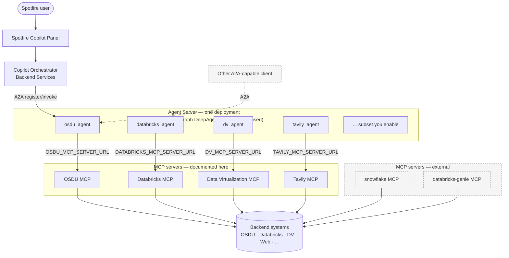

# Spotfire Copilot™ Agent Registry — Ecosystem Agents

**Ecosystem agents** are pre-built, domain-targeted A2A (Agent-to-Agent) agents — hosted by a framework-based agent server and backed by Model Context Protocol (MCP) servers — that you can deploy to give Spotfire Copilot ready-made capabilities. They complement the [Spotfire Copilot Agent Registry](../Spotfire%20Copilot%20-%20Agent%20Registry%20Overview.md).

The agents are built on the [LangChain](https://www.langchain.com/) ecosystem and its LangGraph runtime. The guides here cover deploying them on a **LangGraph DeepAgents server** that Spotfire ships as container images. The images are portable — run them locally with Docker Compose, on managed cloud services like Azure Container Apps or AWS Elastic Container Service, or use the provided Helm charts to deploy to any Kubernetes cluster. Because the agents are standard LangGraph graphs, they are not tied to that server — you can also run them on any LangGraph-compatible runtime (for example AWS Bedrock AgentCore or the Google Cloud Vertex AI Agent Engine).

## How it fits together

There are three layers. You deploy the bottom two and wire them together with URLs and tokens:

1. **Agents** *(capabilities)* — each agent (for example `osdu_agent`, `databricks_agent`, `snowflake_agent`) is a domain-targeted capability you invoke from the Spotfire Copilot Panel. Agents are **not deployed individually** — see layer 2.
2. **Agent server** *(the deployment vehicle)* — a single **LangGraph DeepAgents server** hosts one or more A2A agents on one endpoint. One server deployment can host **all** agents or any **subset** you enable. Two variants are available: **OSS** (open-source LangGraph libraries) and **Licensed** (LangGraph Platform runtime). You register each hosted agent with the Spotfire Copilot orchestrator so the Copilot Panel can invoke it — and because each agent speaks the open **A2A protocol**, its endpoint is equally reachable by any other A2A-capable client or orchestrator you choose to connect.
3. **MCP servers** *(prerequisites)* — each agent reaches its underlying system (OSDU, Databricks, Data Virtualization, Spotfire Library/License, Tavily, and others) through an MCP server that exposes tools over `streamable-http`. Most agents use an MCP server **documented here** (with a user guide and a deployment guide); a few use an **external** MCP server whose docs are not provided in this section. Deploy the MCP servers an agent needs, then point the agent at them with `*_MCP_SERVER_URL` settings.

These ecosystem agents depend on a deployed orchestrator. If you have not installed it yet, start with the [Installation Guide — Backend Setup](../Spotfire%20Copilot%20Backend%20Services/Spotfire%20Copilot%20-%20Installation%20Guide%20-%20Backend%20Setup.md).

## Architecture at a glance

A request flows from the **Spotfire Copilot Panel** to the **orchestrator**, which routes it to a hosted **agent** on your **agent server**. The agent calls its **MCP server** over `streamable-http`, and the MCP server talks to the underlying **backend system**. This is the primary path; because the agents expose standard **A2A** endpoints, other A2A-capable clients can invoke them the same way.



**What a deployment looks like:**

- You stand up **one agent server** (either the OSS or the Licensed variant — not both) that hosts the agents you choose. The same server can carry all agents or a subset.
- For each hosted agent you deploy (or reuse) its **MCP server** and wire it in with the agent's `*_MCP_SERVER_URL` setting. MCP servers marked *documented here* have guides in this section; *external* ones (Snowflake, Databricks Genie, Milvus) you provision from their own product docs.
- You **register** each agent endpoint with the orchestrator once, so the Copilot Panel can invoke it. The same endpoints remain open to any other A2A-capable client.
- MCP servers can be shared across environments and reached by any MCP-capable client — they are not exclusive to the agent server.

## What's in this section

Guides are grouped by document type. Pick a folder based on what you're doing:

```
Ecosystem Agents/
├── Agents/                     End-user guides — how to use each agent from the Copilot Panel
├── MCP Servers/                One subfolder per server — each with a user guide + deployment guide
│   └── <Server>/
│       ├── … MCP Server User Guide.md        Tools and how to consume them
│       └── … MCP Server Deployment Guide.md  How to stand the server up
├── Agent Server Deployment/    Deploy the LangGraph DeepAgents server that hosts the agents (OSS or Licensed)
└── Artifact Sources and Access Shared reference — OCI login and version policy
```

| Folder | Audience | You're here to… |
|---|---|---|
| [Agents](Agents/README.md) | End users | Learn what an agent does and how to prompt it |
| [MCP Servers](MCP%20Servers/README.md) | Operators & integrators | Consume or deploy the MCP backend an agent needs |
| [Agent Server Deployment](Agent%20Server%20Deployment/README.md) | Platform operators | Deploy the one server that hosts the agents |

## Capability matrix

Each capability is delivered by an **agent** (end-user guide) backed by a dedicated **MCP server**. The agent runs inside a deployed [agent server](Agent%20Server%20Deployment/README.md); its MCP server must be reachable before the agent can be invoked. MCP servers marked **External** are consumed by the agent but are not documented in this section. Use this table to jump to the paired guides and to find the `*_MCP_SERVER_URL` env prefix used in the agent server configuration.

| Capability | Agent user guide | A2A agent id | Backing MCP server | MCP | Env prefix |
|---|---|---|---|---|---|
| OSDU | [OSDU Agent](Agents/Spotfire%20Copilot%20-%20OSDU%20Agent%20User%20Guide.md) | `osdu_agent` | [OSDU MCP Server](MCP%20Servers/OSDU/Spotfire%20Copilot%20-%20OSDU%20MCP%20Server%20User%20Guide.md) | Documented | `OSDU` |
| Databricks | [Databricks Agent](Agents/Spotfire%20Copilot%20-%20Databricks%20Agent%20User%20Guide.md) | `databricks_agent` | [Databricks MCP Server](MCP%20Servers/Databricks/Spotfire%20Copilot%20-%20Databricks%20MCP%20Server%20User%20Guide.md) | Documented | `DATABRICKS` |
| Databricks Genie | [Databricks Genie Agent](Agents/Spotfire%20Copilot%20-%20Databricks%20Genie%20Agent%20User%20Guide.md) | `databricks_genie_agent` | `databricks-genie` | External¹ | `GENIE` |
| Data Virtualization | [Data Virtualization (DV) Agent](Agents/Spotfire%20Copilot%20-%20Data%20Virtualization%20%28DV%29%20Agent%20User%20Guide.md) | `dv_agent` | [Data Virtualization (DV) MCP Server](MCP%20Servers/Data%20Virtualization%20%28DV%29/Spotfire%20Copilot%20-%20Data%20Virtualization%20%28DV%29%20MCP%20Server%20User%20Guide.md) | Documented | `DV` |
| Snowflake | [Snowflake Agent](Agents/Spotfire%20Copilot%20-%20Snowflake%20Agent%20User%20Guide.md) | `snowflake_agent` | `snowflake` | External¹ | `SNOWFLAKE` |
| Spotfire Library | [Spotfire Library Metadata Agent](Agents/Spotfire%20Copilot%20-%20Spotfire%20Library%20Metadata%20Agent%20User%20Guide.md) | `sf_lib_md_agent` | [Spotfire Library MCP Server](MCP%20Servers/Spotfire%20Library/Spotfire%20Copilot%20-%20Spotfire%20Library%20MCP%20Server%20User%20Guide.md) | Documented | `SFLIB` |
| Spotfire License | [Spotfire License Management Agent](Agents/Spotfire%20Copilot%20-%20Spotfire%20License%20Management%20Agent%20User%20Guide.md) | `sf_lic_agent` | [Spotfire License MCP Server](MCP%20Servers/Spotfire%20License/Spotfire%20Copilot%20-%20Spotfire%20License%20MCP%20Server%20User%20Guide.md) | Documented | `SFLIC` |
| Web search | [Tavily Web Search Agent](Agents/Spotfire%20Copilot%20-%20Tavily%20Web%20Search%20Agent%20User%20Guide.md) | `tavily_agent` | [Tavily MCP Server](MCP%20Servers/Tavily/Spotfire%20Copilot%20-%20Tavily%20MCP%20Server%20User%20Guide.md) | Documented | `TAVILY` |
| Daily Drilling Reports | [Daily Drilling Reports (DDR) Agent](Agents/Spotfire%20Copilot%20-%20Daily%20Drilling%20Reports%20%28DDR%29%20Agent%20User%20Guide.md) | `ddr_agent` | [Energy DDR Neo4j MCP Server](MCP%20Servers/Energy%20DDR%20Neo4j/Spotfire%20Copilot%20-%20Energy%20DDR%20Neo4j%20MCP%20Server%20User%20Guide.md) | Documented | `DDR` |

¹ **External** MCP servers are consumed by the agent but not documented in this section — deploy them from their own product documentation. The `milvus_agent` (`MILVUS` prefix) ships in the licensed agent set but has no user guide and uses an external MCP server.

## Agent server (LangGraph DeepAgents)

The agents in the matrix are all hosted by a single DeepAgents server. Deploy one variant and point each hosted agent at its MCP server URLs. See [Agent Server Deployment](Agent%20Server%20Deployment/README.md) for the section index, or go directly to a variant:

- **[LangGraph DeepAgents Server — OSS Deployment Guide](Agent%20Server%20Deployment/Spotfire%20Copilot%20-%20LangGraph%20DeepAgents%20Server%20%28OSS%29%20Deployment%20Guide.md)** — deploy the custom DeepAgents server built on open-source LangGraph libraries, via Docker Compose or Helm.
- **[LangGraph DeepAgents Server — Licensed Deployment Guide](Agent%20Server%20Deployment/Spotfire%20Copilot%20-%20LangGraph%20DeepAgents%20Server%20%28Licensed%29%20Deployment%20Guide.md)** — deploy the licensed DeepAgents runtime on the LangGraph Platform, via Helm.

## Shared reference

- **[Artifact Sources and Access](Spotfire%20Copilot%20-%20Artifact%20Sources%20and%20Access.md)** — OCI registry login, artifact pull validation, and version selection policy shared by all guides in this section.

## Suggested order

1. Deploy the [MCP servers](MCP%20Servers/README.md) your agents need (and provision any External MCP servers from their own product docs).
2. Deploy an agent server ([OSS](Agent%20Server%20Deployment/Spotfire%20Copilot%20-%20LangGraph%20DeepAgents%20Server%20%28OSS%29%20Deployment%20Guide.md) or [Licensed](Agent%20Server%20Deployment/Spotfire%20Copilot%20-%20LangGraph%20DeepAgents%20Server%20%28Licensed%29%20Deployment%20Guide.md)) and point each agent at its MCP server URLs.
3. Register each agent endpoint with the orchestrator (see the agent server guide's *Registering A2A Agents with an Orchestrator* section).
