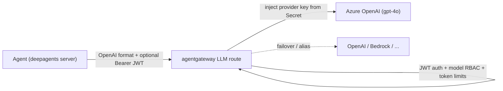

# Spotfire Copilot - LLM Gateway (Model Access via agentgateway)

> **Advanced / enterprise capability.** This guide describes routing the agents'
> LLM calls through **agentgateway** so the gateway — not each agent — holds the
> model provider connection and credentials, and so model access can be governed
> (auth, per-identity RBAC, token/cost limits, failover). The default deployment,
> where each agent talks directly to its model provider, is unchanged and remains
> fully supported. This is a roadmap-adjacent companion to the
> [Per-User Authorization and Token Exchange Guide](./Spotfire%20Copilot%20-%20Per-User%20Authorization%20and%20Token%20Exchange%20Guide.md).

## 1. Why front models with the gateway

Today each agent is configured with its LLM provider endpoint and API key
(Azure OpenAI, OpenAI, …) via environment variables. That means every agent
deployment carries provider secrets, and model access is ungoverned.

Routing model calls through agentgateway gives you:

- **Credential centralization** — the gateway holds the provider key (in a
  Kubernetes Secret); agents call the gateway with **no** provider endpoint or key.
- **Unified interface** — agents speak the OpenAI Chat Completions format to the
  gateway; the gateway routes to whichever provider is configured behind it.
- **Governance** — the same identity plumbing used for MCP (Keycloak JWT) can gate
  *which models an identity may use* and *how many tokens they may spend*.
- **Reliability** — provider failover, load balancing, model aliasing.
- **Observability** — per-request token usage, latency, and cost metrics.

### 1.1 Opt-in — the old way keeps working

This feature is **entirely opt-in and configured the same way as before — through
environment variables**. Nothing about the existing model configuration changes:

- Model selection is still `DEEPAGENTS_MODEL` / `<PREFIX>_DEEPAGENTS_MODEL`, and the
  provider variables (`AZURE_OPENAI_ENDPOINT`, `OPENAI_API_KEY`, `OPENAI_API_VERSION`,
  …) are unchanged.
- **Direct provider access is the default.** The only new variable is
  `OPENAI_BASE_URL` (per-agent `<PREFIX>_OPENAI_BASE_URL`). When it is **unset**, the
  agent talks directly to the provider exactly as it does today.
- **Opt in by setting one variable.** Point `OPENAI_BASE_URL` at the gateway LLM route
  (or point `AZURE_OPENAI_ENDPOINT` at the gateway) for the agents you want to route
  through it. Those agents gain token control, authorization/RBAC, and cost limits;
  every other agent is unaffected.

In short: **users who don't want the gateway change nothing; users who opt in flip one
env var per agent and get the governance benefits.**

## 2. Architecture



The gateway presents an **OpenAI-compatible endpoint** and automatically rewrites
each request to the configured provider's chat-completions API.

## 3. How the agents build their model client (and how to repoint it)

The deepagents server builds its chat model in
`agents/deepagents/deepagents_shared/model_factory.py` via
`build_chat_model(prefix=<AGENT>)`. Two provider paths:

| Path | Client | Reads from env | Repointable at a gateway? |
|---|---|---|---|
| Azure | `AzureChatOpenAI` | `AZURE_OPENAI_ENDPOINT`, `AZURE_OPENAI_API_KEY`, `OPENAI_API_VERSION` | via env (endpoint) |
| OpenAI | `ChatOpenAI` | `OPENAI_API_KEY`, **`OPENAI_BASE_URL`** | via env (base URL) |

Model selection is per-agent: `DEEPAGENTS_MODEL=openai:gpt-5.1` globally, with
`<PREFIX>_DEEPAGENTS_MODEL` overrides (e.g. `SFLIB_DEEPAGENTS_MODEL=azure_openai:gpt-4o`).

**Recommended repoint = OpenAI-compatible.** Point the agent's OpenAI client at the
gateway's LLM route; the gateway handles the real provider (Azure, OpenAI, …). This
decouples agents from providers entirely. The model factory reads `OPENAI_BASE_URL`
(and `<PREFIX>_OPENAI_BASE_URL`); when set, requests go to the gateway. When unset,
behavior is unchanged (default provider path), so existing deployments are unaffected.

## 4. Configure gateway model access

Two ways to expose models, both values-driven in the `agent-gateway-routes` chart.
**Prefer model-name routing** — it is the gateway-agnostic surface (identical to what
LiteLLM, OpenRouter, and vLLM expose), so the agents never learn anything
gateway-specific and you can swap the gateway later without touching them.

### 4.1 Model-name routing (recommended, gateway-agnostic)

Each `llmModels` entry renders one `AgentgatewayModel`. Clients call the gateway's
built-in OpenAI-compatible endpoints — `POST /v1/chat/completions` (routed by the
request's `model` name) and `GET /v1/models` (auto-generated discovery). Agents just
set `OPENAI_BASE_URL=http://<gateway>/v1` and `DEEPAGENTS_MODEL=openai:<name>`.

```yaml
# values.<env>.yaml
llmModels:
  - name: azureopenai-gpt-4o     # client-facing model name (== /v1/models id)
    provider: Azure
    azure: { resourceName: openai-tibco, resourceType: OpenAI, apiVersion: "2024-10-21" }
    auth: { secretRef: azure-openai-key }   # Secret holds the key under `Authorization`
    transformations:                        # rewrite the UPSTREAM model (see note below)
      - { field: model, expression: "'gpt-4o'" }
  - name: azurefoundry-claude-opus-5   # Claude Opus 5 on Azure AI Foundry
    provider: Azure
    azure: { resourceName: openai-tibco, resourceType: Foundry, projectName: SpotfireCopilot }
    auth: { secretRef: azure-foundry-key }
    transformations:
      - { field: model, expression: "'claude-opus-5'" }
```

Providers: `Azure`, `OpenAI`, `Anthropic`, `Bedrock`, `VertexAI`, `Gemini`, `Custom`,
and more. Optional per entry: `match` (exact | `suffix*` | `*prefix` | `*`), `baseURL`,
`visibility` (`Public`/`Internal`), and `transformations` (see below). Create the
referenced Secret out-of-band.

#### Naming convention & the `transformations` model rewrite

The `AgentgatewayModel` API **routes by the request's `model` name and has no
upstream-model field** — by default it forwards that name verbatim to the provider (so
the Azure *deployment* / OpenAI *model* must literally equal the entry `name`). Two
consequences:

- **Naming convention.** Prefer **`<platform>-<model>`** (e.g. `azureopenai-gpt-5`,
  `openai-gpt-5`, `azurefoundry-claude-opus-5`, `bedrock-claude-sonnet`). It groups
  models by serving platform in `/v1/models` and avoids collision with LangChain's
  `provider:model` colon syntax (we use a hyphen).
- **`transformations` rewrite.** Whenever the client-facing `name` differs from the real
  upstream id — which is **always** with the convention above, and **required** when you
  expose the *same* real model on two platforms (e.g. `gpt-5` on Azure **and** OpenAI) —
  add a CEL `transformations` entry that rewrites the upstream `model` back to the real
  id. Each entry is `{ field: model, expression: "'<real-upstream-id>'" }` (the value is a
  CEL string literal, so the inner quotes are required). Example — one real `gpt-5`,
  two routable names:

  ```yaml
  llmModels:
    - name: azureopenai-gpt-5
      provider: Azure
      azure: { resourceName: openai-tibco, resourceType: OpenAI, apiVersion: "2024-10-21" }
      auth: { secretRef: azure-openai-key }
      transformations: [{ field: model, expression: "'gpt-5'" }]
    - name: openai-gpt-5
      provider: OpenAI
      auth: { secretRef: openai-key }
      transformations: [{ field: model, expression: "'gpt-5'" }]
  ```

  Agents then pick the platform purely by name: `DEEPAGENTS_MODEL=openai:azureopenai-gpt-5`
  vs `openai:openai-gpt-5` (the `openai:` prefix is the SDK/gateway transport; the token
  after it is the gateway model name above). Per-agent override:
  `LANGGRAPH_OSS_<AGENT>_DEEPAGENTS_MODEL`.

  **`transformations` aren't only for `model`.** Any request field can be normalized the
  same way — a common case is **reasoning models** (`gpt-5`, `o1`, …) that reject
  `temperature != 1`. Colocating the constraint on the model entry fixes it for *every*
  caller (no per-agent config), e.g.:

  ```yaml
    - name: azureopenai-gpt-5
      provider: Azure
      azure: { resourceName: openai-tibco, resourceType: OpenAI, apiVersion: "2024-10-21" }
      auth: { secretRef: azure-openai-key }
      transformations:
        - { field: model, expression: "'gpt-5'" }
        - { field: temperature, expression: "1" }   # reasoning model: only temperature=1 is accepted
  ```

**One-time platform prerequisites** (gateway-wide, not rendered by this chart):

1. Enable the (experimental in v1.4) model API on the control plane —
   `agentgatewayModels.enabled: true`:
   ```bash
   helm upgrade agentgateway oci://cr.agentgateway.dev/charts/agentgateway --version v1.4.1 \
     -n agentgateway-system -f cp-values.yaml   # cp-values sets agentgatewayModels.enabled: true
   ```
2. Let the Gateway listener serve LLM traffic by allowing the `AgentgatewayModel`
   route kind **alongside** `HTTPRoute` (so MCP/A2A routes keep working):
   ```bash
   kubectl -n agentgateway-system patch gateway agentgateway-proxy --type merge -p \
     '{"spec":{"listeners":[{"name":"http","port":80,"protocol":"HTTP","allowedRoutes":{"namespaces":{"from":"All"},"kinds":[{"group":"gateway.networking.k8s.io","kind":"HTTPRoute"},{"group":"agentgateway.dev","kind":"AgentgatewayModel"}]}}]}}'
   ```

Verify: `curl http://<gw>/v1/models` lists your models, and `POST /v1/chat/completions`
with `{"model":"gpt-4o",...}` returns a completion.

### 4.2 Path-per-model routing (advanced / legacy)

The `llmBackends` list renders one `AgentgatewayBackend` (`spec.ai`) + one `HTTPRoute`
per model on `PathPrefix /llm-<name>` (naming `<provider>-<model>` →
`/llm-<provider>-<model>`). Use it only when you need custom paths or a per-route
`AgentgatewayPolicy` that the model API can't express — an `AgentgatewayPolicy` cannot
target an `AgentgatewayModel`, so per-model policy there uses the inline `spec.policies`.

```yaml
# values.<env>.yaml  (advanced)
llmBackends:
  - name: azure-gpt4o           # -> /llm-azure-gpt4o
    provider:
      azure: { resourceName: openai-tibco, resourceType: OpenAI, model: gpt-4o, apiVersion: "2024-10-21" }
    auth: { secretRef: azure-openai-key }
```

With path routes, **one route = one model** (the backend pins `model`; the request's
`model` is ignored), and the agent points `OPENAI_BASE_URL` at the specific
`/llm-<name>/v1` route. Prefer §4.1 unless you have a concrete reason not to.

Create the referenced Secret out-of-band (the chart only references it):
```bash
kubectl -n agentgateway-system create secret generic azure-openai-key \
  --from-literal=Authorization="$AZURE_OPENAI_API_KEY"
```

**Credential options** (`auth`): `secretRef` (recommended), inline `key`, or
`passthrough` (reuse the caller's validated JWT as the upstream credential); Bedrock
uses AWS auth (IRSA) with no Secret.


### 4.3 Adding a new model (runbook)

Adding a model is a repeatable, **config-only** workflow — no code or template changes:

1. **Get the provider coordinates.**
   - Azure OpenAI: resource name + deployment name (e.g. `openai-tibco` / `gpt-4o`).
   - **Azure AI Foundry** (Claude, Llama, and other non-OpenAI models on Azure):
     resource name + **project name** + model name.
   - OpenAI / Anthropic: model id. Bedrock: model id + region.
2. **Create the credential Secret** in `agentgateway-system` (skip for Bedrock/Entra ID):
   ```bash
   kubectl -n agentgateway-system create secret generic <secret-name> \
     --from-literal=Authorization="$PROVIDER_KEY"
   ```
3. **Add one `llmModels` entry** to `values.<env>.yaml` (model-name routing, §4.1). Use
   the **`<platform>-<model>`** naming convention; the `name` is the client-facing model
   name that shows up in `/v1/models`, and a `transformations` rewrite maps it to the
   real upstream deployment/model id:
   ```yaml
   llmModels:
     - name: azureopenai-gpt-4o           # Azure OpenAI (deployment gpt-4o on openai-tibco)
       provider: Azure
       azure: { resourceName: openai-tibco, resourceType: OpenAI, apiVersion: "2024-10-21" }
       auth: { secretRef: azure-openai-key }
       transformations: [{ field: model, expression: "'gpt-4o'" }]
     - name: azurefoundry-claude-opus-5   # Claude Opus 5 on Azure AI Foundry
       provider: Azure
       azure: { resourceName: openai-tibco, resourceType: Foundry, projectName: SpotfireCopilot }
       auth: { secretRef: azure-foundry-key }
       transformations: [{ field: model, expression: "'claude-opus-5'" }]
   ```
   > **Foundry needs agentgateway v1.4+.** Native Anthropic-on-Foundry support (PR #2190)
   > and the Foundry hostname fix (#1906) landed in v1.4. On v1.2.x the Anthropic response
   > parser rejected Foundry's body (*"missing field `type`"* — Foundry orders `model`
   > first while native Anthropic puts `type` first). On v1.4.1 the config above returns a
   > real completion (HTTP 200, verified).
4. **Redeploy the routes chart** — creates the model + `/v1` routing:
   `./gw-test.sh --env <env> all`. Always deploy `all`, not a single subset (a subset run
   prunes every resource not in the subset).
5. **Price the model** so cost shows in the dashboards (built-in LLM Analytics **and**
   Grafana read the same computed cost). Add the model to the cost catalog and roll the
   platform chart. Rates are strings, **USD per 1,000,000 tokens**; the provider key is the
   `gen_ai_system` label (`azure` for anything fronted by Azure/Foundry here):
   ```jsonc
   // devops/charts/agentgateway-platform/files/model-cost-catalog.json
   { "providers": { "azure": { "models": {
       "claude-opus-5": { "rates": { "input": "15", "output": "75", "cacheRead": "1.5", "cacheWrite": "18.75" } }
   } } } }
   ```
   ```bash
   helm upgrade agentgateway-platform ./agentgateway-platform \
     -n agentgateway-system --set analytics.enabled=true --wait
   ```
   agentgateway **hot-reloads** the catalog (~1 min, no pod restart). This is the *only*
   place rates live — it feeds both dashboards. Skip this step to leave the model unpriced
   (dashboards still show tokens/latency; cost renders as `$0`). Keep `--set
   analytics.enabled=true` so analytics isn't turned off by the earlier install-time flag.
6. **Point agents at it** (env only). One base URL for the whole server; each agent just
   names its model:
   ```
   OPENAI_BASE_URL=http://agentgateway-proxy.agentgateway-system.svc.cluster.local/v1
   DEEPAGENTS_MODEL=openai:gpt-4o                     # fleet default
   DATABRICKS_DEEPAGENTS_MODEL=openai:claude-opus-5   # one agent, a different model
   ```
7. **Verify:**
   ```bash
   curl http://<gw>/v1/models                          # new model listed
   curl http://<gw>/v1/chat/completions -d '{"model":"claude-opus-5","messages":[{"role":"user","content":"hi"}]}'
   # priced? want status="Exact" (not Missing/Unpriced/NoCatalog):
   kubectl -n agentgateway-system port-forward deploy/agentgateway-proxy 15020:15020 &
   curl -s localhost:15020/metrics | grep agentgateway_cost_catalog_lookups_total | grep <model-name>
   ```
   Then confirm it shows in **Grafana** (the *AgentGateway* dashboard) and the built-in
   **LLM → Analytics** page (`kubectl -n agentgateway-system port-forward deploy/agentgateway-proxy 15000:15000`
   → `http://localhost:15000/ui/llm/analytics`).

For an existing provider type, steps **3 → 5** are the whole change (routing + pricing). A
brand-new provider type also adds the Secret (step 2). No code or template changes.

## 5. Governance — auth, model RBAC, and token policies

All of these are `AgentgatewayPolicy.spec.traffic` policies on the LLM route and
**reuse the Keycloak identity** we already established for MCP:

1. **Authentication** — `jwtAuthentication` (Keycloak) → only valid identities may
   call models. A dedicated `aud=llm` keeps model tokens distinct from `mcp`/`a2a`.
2. **Per-identity model RBAC** — `authorization` with a CEL expression over
   `jwt.realm_access.roles`, mirroring the `<domain>-privileged` convention (e.g.
   `"model-gpt4-privileged" in jwt.realm_access.roles`). Backend policies can target
   a specific provider by `sectionName`, so different roles get different models.
3. **Token & request limits** — `rateLimit` supports `local`, `global` (external
   service), and `conditional` (keyed on JWT claims) → per-user / per-role **token**
   and request budgets. Combine with **cost controls** to attribute and cap spend.
4. **Guardrails** — prompt guards filter harmful or policy-violating prompts/responses.

Example governance policy:
```yaml
traffic:
  jwtAuthentication: { providers: [ { issuer: https://keycloak.field.spotfire.com/realms/master, audiences: [llm], jwks: { ... } } ] }
  authorization:
    action: Allow
    policy: { matchExpressions: [ '"model-gpt4-privileged" in jwt.realm_access.roles' ] }
  rateLimit:
    conditional: [ ]   # per-role token budgets keyed on jwt claims
```

This is the same governance model as MCP, one layer up: **Keycloak issues identity
→ the gateway enforces per-tool RBAC (MCP) and per-model RBAC + token budgets (LLM).**

## 6. Repoint an agent through the gateway

Env-only, and gateway-agnostic. Set **one** base URL for the whole server and let each
agent name its model (which must exist in `/v1/models`). This is the same surface
LiteLLM/OpenRouter expose, so swapping the gateway is a one-line change.

```
# One base for the whole fleet (empty = direct-to-provider; the gateway is opt-in):
OPENAI_BASE_URL=http://agentgateway-proxy.agentgateway-system.svc.cluster.local/v1
DEEPAGENTS_MODEL=openai:gpt-4o                     # fleet default model name
DATABRICKS_DEEPAGENTS_MODEL=openai:claude-opus-5   # one agent, a different model
OPENAI_API_KEY=<any value; the gateway injects the real provider key per model>
```

Switch a model by changing the **name** (`openai:gpt-4o` → `openai:claude-opus-5`) — no
per-agent URL. Switch gateways (e.g. to LiteLLM) by changing `OPENAI_BASE_URL` alone.
Deploy-time knobs live in the deepagents OSS chart (`config.*` / `LANGGRAPH_OSS_*`), so
this is a values change plus a redeploy — no code change (the OpenAI SDK reads
`OPENAI_BASE_URL` natively; the additive `model_factory` support makes it explicit and
enables per-agent `<PREFIX>_OPENAI_BASE_URL` overrides).

## 7. Verification

```bash
kubectl -n agentgateway-system port-forward svc/agentgateway-proxy 9080:80 &
# Model discovery (auto-generated from the AgentgatewayModel resources):
curl -s localhost:9080/v1/models | jq
# Model-name-routed completion:
curl -s localhost:9080/v1/chat/completions -H 'content-type: application/json' -d '{
  "model": "gpt-4o",
  "messages": [{"role":"user","content":"Write a short haiku about cloud computing."}]
}' | jq
```
A successful response returns OpenAI-format `choices` and a `usage` block with
`total_tokens` — confirming the gateway routed by model name and injected the key.

## 8. Security considerations

- **Keys live only at the gateway** (Kubernetes Secret), not in agent deployments.
- **Enable auth before non-test use** — an unauthenticated LLM route lets anyone who
  can reach it spend your provider budget. Add `jwtAuthentication` + `authorization`.
- **Set token/cost limits** to bound spend per identity.
- **Prefer `passthrough`/dedicated audience** so model tokens are scoped and auditable.

## 9. Status & roadmap

- **Prototyped & verified:** Azure OpenAI (`gpt-4o`) fronted through the gateway as an
  OpenAI-compatible route; agent repoint enabled via `OPENAI_BASE_URL` (additive).
- **Next:** add JWT auth + per-role model RBAC + token/cost limits on the LLM route;
  fold the backend/route into the `agent-gateway-routes` chart (like `mcpServers`);
  optionally add provider failover and model aliases.
