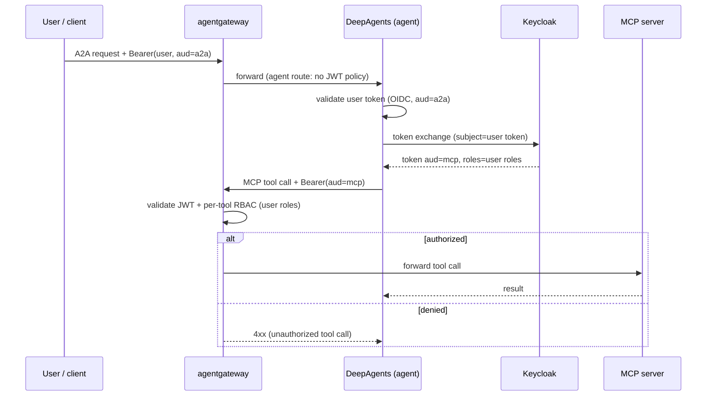
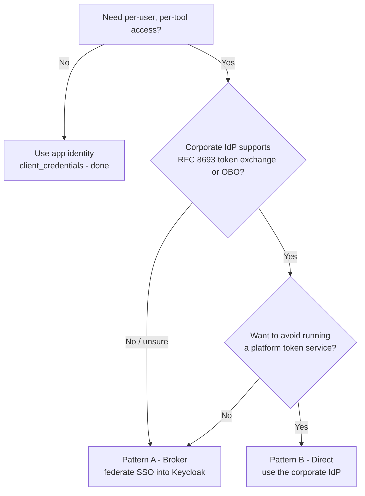

# Spotfire Copilot - Per-User Authorization and Token Exchange Guide

> **Status: DRAFT for review.** This guide documents the identity, authorization,
> and OAuth 2.0 token-exchange model that lets Spotfire Copilot enforce
> **per-user, per-tool access** to MCP tools reached through agents. Placement
> and cross-links may be adjusted to fit the documentation set.

## Table of Contents

- [1. Introduction](#1-introduction)
  - [1.1 Purpose and audience](#11-purpose-and-audience)
  - [1.2 What this enables](#12-what-this-enables)
- [2. Concepts and architecture](#2-concepts-and-architecture)
  - [2.1 Roles (OAuth 2.1 / MCP)](#21-roles-oauth-21--mcp)
  - [2.2 Why token exchange (not token pass-through)](#22-why-token-exchange-not-token-pass-through)
  - [2.3 One enforcement point per route](#23-one-enforcement-point-per-route)
  - [2.4 End-to-end request flow](#24-end-to-end-request-flow)
- [3. Identity provider: corporate SSO or the bundled Keycloak](#3-identity-provider-corporate-sso-or-the-bundled-keycloak)
  - [3.1 An advanced (enterprise) capability](#31-an-advanced-enterprise-capability)
  - [3.2 What the identity layer must provide](#32-what-the-identity-layer-must-provide)
  - [3.3 Two integration patterns](#33-two-integration-patterns)
  - [3.4 The platform token service (bundled Keycloak)](#34-the-platform-token-service-bundled-keycloak)
  - [3.5 Pattern A — federate corporate SSO into Keycloak](#35-pattern-a--federate-corporate-sso-into-keycloak)
  - [3.6 Pattern B — use the corporate IdP's native token exchange](#36-pattern-b--use-the-corporate-idps-native-token-exchange)
- [4. Gateway authorization (agentgateway)](#4-gateway-authorization-agentgateway)
  - [4.1 JWT authentication](#41-jwt-authentication)
  - [4.2 Per-tool RBAC](#42-per-tool-rbac)
  - [4.3 Per-agent RBAC](#43-per-agent-rbac)
- [5. Agent server configuration (DeepAgents)](#5-agent-server-configuration-deepagents)
  - [5.1 Inbound A2A authentication](#51-inbound-a2a-authentication)
  - [5.2 Outbound MCP token exchange](#52-outbound-mcp-token-exchange)
  - [5.3 Environment variable reference](#53-environment-variable-reference)
  - [5.4 The tool-list nuance](#54-the-tool-list-nuance)
- [6. Verification](#6-verification)
- [7. Security considerations](#7-security-considerations)
- [8. Operations and troubleshooting](#8-operations-and-troubleshooting)

## 1. Introduction

### 1.1 Purpose and audience

This guide is for platform operators who deploy Spotfire Copilot's DeepAgents
server, MCP servers, the agentgateway data plane, and the Keycloak identity
provider, and who need **different users to have different access to MCP tools**
even when those tools are invoked *through* an agent.

It complements:

- [DeepAgents Server (OSS) Deployment Guide](./Spotfire%20Copilot%20-%20LangGraph%20DeepAgents%20Server%20(OSS)%20Deployment%20Guide.md)
- [DeepAgents Server (Licensed) Deployment Guide](./Spotfire%20Copilot%20-%20LangGraph%20DeepAgents%20Server%20(Licensed)%20Deployment%20Guide.md)

### 1.2 What this enables

- **Per-tool authorization**: a caller may use some MCP tools but not others,
  decided by their identity/roles (for example, only `role=admin` may run a
  query-execution tool; everyone may run read/metadata tools).
- **Per-agent authorization**: control which callers/roles may reach a specific
  agent route at all.
- **Agent-mediated per-user authorization**: when a user talks to an agent, the
  agent calls MCP tools **as that user** — so the same authorization rules apply
  whether the user calls the tool directly or via the agent.

> **This is an advanced (enterprise) capability, and identity-provider agnostic.**
> The **default** Spotfire Copilot configuration — an agent calling its tools with a
> single application identity — is the standard starting point for most
> deployments and what most clients begin with. Per-user authentication and
> authorization is an **enterprise add-on** for organizations that want full,
> identity-aware access control across agents, tools, and (on the roadmap) models
> and token-level controls. It works with **any** OIDC/SAML corporate SSO (Okta,
> Microsoft Entra ID, PingFederate, ForgeRock, PureAuth, …). See
> [Section 3](#3-identity-provider-corporate-sso-or-the-bundled-keycloak).

## 2. Concepts and architecture

Three components cooperate:

| Component | Role |
| --- | --- |
| **Keycloak** | OAuth 2.1 Authorization Server. Issues and exchanges tokens; holds users, roles, and clients. |
| **agentgateway** | Data-plane proxy in front of MCP servers and agents. Acts as the OAuth **Resource Server**: validates JWTs and enforces authorization (per-tool, per-agent). |
| **DeepAgents server** | Hosts the agents. Validates the inbound user token and, for each outbound MCP call, obtains a token that represents the user via **token exchange**. |

### 2.1 Roles (OAuth 2.1 / MCP)

The Model Context Protocol authorization specification treats a protected MCP
server as an **OAuth 2.1 Resource Server** that must validate that access tokens
were issued specifically for it (the `aud` claim). In this deployment,
agentgateway performs that validation on behalf of the MCP servers, and adds
fine-grained per-tool authorization.

- Tokens for **agents** carry `aud=a2a`.
- Tokens for **MCP servers** carry `aud=mcp`.

### 2.2 Why token exchange (not token pass-through)

The MCP authorization specification **forbids token pass-through**: an MCP server
(or an agent acting as an MCP client) must **not** forward the token it received
to a downstream service. Downstream calls must use a **separate token issued for
that downstream audience**. Forwarding the original token creates a "confused
deputy" vulnerability.

Therefore, when an agent needs to call an MCP tool on behalf of a user, it does
**not** send the user's `aud=a2a` token to the MCP server. Instead it performs an
**OAuth 2.0 Token Exchange** (RFC 8693): it swaps the user's token for a fresh
`aud=mcp` token that **preserves the user's identity and roles**. The gateway
then authorizes the MCP call against the *user's* roles.

### 2.3 One enforcement point per route

agentgateway's JWT policy **consumes** the `Authorization` header when it
validates a token — the backend behind that route does not receive the bearer
token. Consequently each route has exactly **one** enforcement point:

| Route | Recommended enforcement |
| --- | --- |
| MCP route (e.g. `/mcp-dv`) | **Gateway**: JWT (`aud=mcp`) + per-tool RBAC. MCP server auth OFF. |
| Agent route (e.g. `/dv-agent`) | **Server**: DeepAgents validates the user's `aud=a2a` token (OIDC). No gateway JWT on this route, so the raw user token reaches the server for token exchange. Keeps the agent card public. |

Do **not** enable the gateway JWT policy *and* server-side validation on the same
route — the gateway would strip the token before the server could use it.

### 2.4 End-to-end request flow



## 3. Identity provider: corporate SSO or the bundled Keycloak

### 3.1 An advanced (enterprise) capability

The **default** Spotfire Copilot configuration is the standard starting point for
most deployments and what most clients begin with: an agent calls its MCP tools
with a single **application identity** (static bearer tokens or a Keycloak-minted
`client_credentials` token), and inbound A2A auth uses `none` / `apikey` /
`bearer` / `mtls`. This remains the default — nothing in this guide is required to
run Spotfire Copilot.

Per-user authentication and authorization is an **enterprise / advanced feature**
for organizations that want full, identity-aware access control across the
platform. Today it covers:

- **Agents** — which callers/roles may reach a given agent (per-agent RBAC).
- **Tools** — which MCP tools a given user may use (per-tool RBAC), enforced with
  the user's identity even when tools are called through an agent.

Identity-aware control of **models** and finer-grained **token** controls are on
the roadmap and will extend the same model.

Enable the feature by opting in (`MCP_TOKEN_EXCHANGE` + `A2A_AUTH_MODE=oidc`);
otherwise the default configuration applies unchanged.

### 3.2 What the identity layer must provide

The model is **identity-provider agnostic**. Whichever IdP you use, the identity
layer must supply four things:

1. **User authentication** (OIDC or SAML). Any corporate SSO — Okta, Microsoft
   Entra ID (Azure AD), PingFederate, ForgeRock, PureAuth, etc. — does this.
2. **Audience-bound access tokens** — a token for agents carrying `aud=a2a`,
   validated by the gateway/agent.
3. **User roles/groups as a token claim** the gateway can evaluate (for example
   `realm_access.roles`, `groups`, or a custom claim).
4. **Delegated acquisition of a downstream MCP token** (`aud=mcp`) that
   **preserves the user's identity and roles** — i.e. OAuth 2.0 Token Exchange
   (RFC 8693) or an equivalent On-Behalf-Of (OBO) flow.

Item 4 is the crux. Most corporate SSO systems authenticate users well, but not
all expose a standard token-exchange grant. This drives the choice between the
two integration patterns below.

### 3.3 Two integration patterns

| | **Pattern A — Broker (recommended)** | **Pattern B — Direct** |
| --- | --- | --- |
| Idea | Keep a platform token service (bundled Keycloak) and **federate** corporate SSO into it. | Point the platform at the corporate IdP for authentication **and** token issuance/exchange. |
| Corporate IdP must support | Authentication + group/role claims (OIDC or SAML). | Authentication + audience-bound tokens + role claims + **token exchange / OBO**. |
| Token exchange performed by | Keycloak (always available). | The corporate IdP. |
| Coupling to IdP features | Low; IdP-agnostic. | Higher; depends on IdP capabilities. |
| Best when | Corporate IdP lacks token exchange, or you want one consistent token model. | Corporate IdP natively supports RFC 8693 / OBO and you want no extra component. |

**Pattern A is recommended** for most enterprises: corporate SSO handles login;
Keycloak provides the audience-bound tokens and the token exchange that the
corporate IdP may not offer.



### 3.4 The platform token service (bundled Keycloak)

Used **directly** (its own users) or as the **broker** in Pattern A. Deploy it
persistently (external database or bundled PostgreSQL with a persistent volume)
so realm/client configuration survives restarts. A reference Helm chart is
provided at `devops/charts/keycloak` (Keycloak 26.x, PostgreSQL backend, hostname
pinning behind an ALB, optional realm import). Do **not** run production Keycloak
with the in-memory H2 database — any restart wipes all clients, roles, and users.

**Clients and audiences:**

| Client | Purpose | Key settings |
| --- | --- | --- |
| `mcp-clients` | The agent's identity for outbound MCP calls; performs token exchange. | Confidential; service account enabled; audience mapper `aud=mcp`; **Standard Token Exchange enabled**. |
| `agent-clients` / your front-end client | Mints the user's `aud=a2a` token. | Confidential/public per your login flow; audience mapper `aud=a2a`; **plus an audience mapper adding `mcp-clients`**. |

**Standard Token Exchange (Keycloak 26.2+)** is enabled **per client** (client
attribute `standard.token.exchange.enabled=true`) on `mcp-clients`. Two v2
constraints, both handled by configuration:

1. The requesting client (`mcp-clients`) must be in the **subject token's
   audience** — add an *Audience* mapper with *Included Client Audience =
   `mcp-clients`* to the client that mints the user token. Otherwise exchange
   fails with "Client is not within the token audience".
2. Do **not** request a non-client audience — the `aud=mcp` claim comes from the
   `mcp-clients` audience mapper. Requesting `audience=mcp` fails with "Audience
   not found". Leave [`MCP_EXCHANGE_AUDIENCE`](#53-environment-variable-reference)
   empty.

The chart's `provision-realm.sh` creates these clients, mappers, and settings
idempotently — treat it as the source of truth for the realm's Copilot clients.

### 3.5 Pattern A — federate corporate SSO into Keycloak

Users authenticate with corporate SSO; Keycloak issues the platform tokens and
performs the exchange. The corporate IdP does **not** need token-exchange support.

1. **Add the corporate IdP as an Identity Provider** in Keycloak (Identity
   Providers → *OpenID Connect v1.0* or *SAML v2.0*). Provide the corporate IdP's
   discovery URL / metadata and register Keycloak as an application in the
   corporate IdP (client id + secret / SAML SP metadata).
2. **Map corporate groups/roles to Keycloak roles** using IdP mappers
   (*Claim to Role* / *Attribute Importer*), so the tokens Keycloak issues carry
   the roles the gateway CEL checks (for example `realm_access.roles` or a custom
   claim).
3. **Keep `mcp-clients` / `agent-clients`** (and their audience mappers) exactly
   as in 3.4 — they still mint and exchange the platform tokens.
4. Users now log in via corporate SSO; the rest of the flow
   (`aud=a2a` → exchange → `aud=mcp`) is unchanged.

Per-IdP notes (federation):

- **Okta**: register Keycloak as an OIDC app in Okta; use Okta's OIDC discovery;
  emit a `groups` claim and map it to Keycloak roles.
- **Microsoft Entra ID**: register Keycloak as an app registration; use Entra
  OIDC; map app roles / group claims to Keycloak roles.
- **PingFederate / ForgeRock**: OIDC or SAML federation; map attributes to roles.
- **PureAuth / other OIDC IdPs**: OIDC federation via the discovery URL; map
  claims to roles.

#### Worked example: Okta → Keycloak

Goal: members of the Okta group `dv-power-users` gain the Keycloak realm role
`dv-privileged` (the role the gateway policy checks).

1. **Register Keycloak in Okta** as an OIDC web app; note the client id/secret and
   Okta's discovery URL
   `https://<org>.okta.com/oauth2/default/.well-known/openid-configuration`. Add a
   `groups` claim to the access token (Okta → Security → API → Authorization
   Servers → Claims).
2. **Add Okta as an Identity Provider in Keycloak** (console: Identity Providers
   → *OpenID Connect v1.0* → *Import from URL* with Okta's discovery URL, then
   paste the client id/secret). Equivalent `kcadm`:

   ```bash
   kcadm.sh create identity-provider/instances -r master \
     -s alias=okta -s providerId=oidc -s enabled=true \
     -s 'config.clientId=<okta-client-id>' \
     -s 'config.clientSecret=<okta-client-secret>' \
     -s 'config.authorizationUrl=https://<org>.okta.com/oauth2/default/v1/authorize' \
     -s 'config.tokenUrl=https://<org>.okta.com/oauth2/default/v1/token' \
     -s 'config.jwksUrl=https://<org>.okta.com/oauth2/default/v1/keys' \
     -s 'config.defaultScope=openid profile email groups'
   ```

3. **Map the Okta group to a Keycloak role** (console: the Okta IdP → Mappers →
   Add → *Claim to Role*: Claim `groups` = `dv-power-users` → Role `dv-privileged`).
4. Users choose "Sign in with Okta", authenticate at Okta, and Keycloak issues the
   platform tokens. After exchange, the `aud=mcp` token carries the mapped role:

   ```json
   {
     "aud": ["mcp"],
     "azp": "mcp-clients",
     "sub": "<user-id>",
     "realm_access": { "roles": ["dv-privileged", "..."] }
   }
   ```

Nothing in `mcp-clients`, the gateway policy, or the agent changes — only the
login source and the group→role mapping.

### 3.6 Pattern B — use the corporate IdP's native token exchange

If your corporate IdP natively supports a token-exchange (RFC 8693) or OBO grant,
you can point the platform at it directly and omit Keycloak:

1. Set `A2A_OIDC_ISSUER` / `A2A_OIDC_AUDIENCE` / `A2A_OIDC_JWKS_URL` (and the
   gateway JWT policy's issuer/JWKS/audiences) to the corporate IdP.
2. Define two audiences/API resources (`a2a` and `mcp`) and a confidential client
   for the agent (the `mcp-clients` equivalent) authorized to perform the
   exchange, with role/group claims included in the tokens.
3. Set `KEYCLOAK_TOKEN_URL` (the agent's token endpoint — despite the name, any
   IdP token endpoint) to the corporate IdP's token endpoint, `MCP_CLIENT_ID` /
   `MCP_CLIENT_SECRET` to the corporate client, and `MCP_TOKEN_EXCHANGE=1`.
4. Ensure the user's token includes the agent client in its audience (the RFC
   8693 "requesting client must be an audience" requirement) or the IdP's OBO
   equivalent.

Per-IdP capability notes:

- **Okta**: a Custom Authorization Server supports the token-exchange grant in
  eligible editions — confirm availability with your Okta administrator, then
  configure the grant, scopes, and a `groups` claim.
- **Microsoft Entra ID**: uses the **On-Behalf-Of (OBO)** flow to swap the user's
  token for one scoped to the MCP API while preserving the user. OBO parameters
  differ from RFC 8693, so the agent's exchange call may need an OBO-specific
  adapter.
- **PingFederate / ForgeRock**: native RFC 8693 token exchange — configure the
  exchange policy and audiences.
- **Others (including PureAuth)**: verify RFC 8693 support; if it is absent, use
  Pattern A.

**Delegation request, by IdP.** The agent makes one of these calls to obtain the
`aud=mcp` token (the bundled minter sends the first form):

```http
# Keycloak / Ping / ForgeRock - RFC 8693 token exchange
POST /realms/<realm>/protocol/openid-connect/token
grant_type=urn:ietf:params:oauth:grant-type:token-exchange
client_id=mcp-clients&client_secret=<secret>
subject_token=<user aud=a2a token>
subject_token_type=urn:ietf:params:oauth:token-type:access_token
requested_token_type=urn:ietf:params:oauth:token-type:access_token
```

```http
# Okta Custom Authorization Server - token exchange
POST /oauth2/<as-id>/v1/token
grant_type=urn:ietf:params:oauth:grant-type:token-exchange
client_id=<okta-client>&client_secret=<secret>
subject_token=<user token>
subject_token_type=urn:ietf:params:oauth:token-type:access_token
audience=api://mcp
```

```http
# Microsoft Entra ID - On-Behalf-Of (OBO)
POST /<tenant>/oauth2/v2.0/token
grant_type=urn:ietf:params:oauth:grant-type:jwt-bearer
client_id=<app-id>&client_secret=<secret>
assertion=<user token>
scope=api://mcp/.default
requested_token_use=on_behalf_of
```

Entra's OBO parameters (`assertion`, `requested_token_use`) differ from RFC 8693,
so the bundled minter needs a small adapter to speak OBO.

> **Note.** The bundled agent minter targets the **standard RFC 8693
> token-exchange grant**. IdPs whose delegation grant differs (for example Entra
> OBO) may require a small code adapter. Pattern A avoids this by standardizing
> the exchange on Keycloak.

## 4. Gateway authorization (agentgateway)

Authorization is expressed as `AgentgatewayPolicy` resources. The reference chart
`devops/charts/agent-gateway-routes` renders these from a values catalog.

### 4.1 JWT authentication

Each MCP route carries a JWT policy that validates the issuer, the JWKS, and the
audience (`aud=mcp`). Validation **consumes** the token, so the MCP server itself
runs with authentication disabled.

### 4.2 Per-tool RBAC

Per-tool authorization is **exception-based**: every tool is **open** unless you
list it as a restricted exception. A server with no restricted tools needs **no
policy at all**. A per-tool policy targets the MCP `AgentgatewayBackend` and, for
each restricted tool, requires a role — expressed as a CEL that returns `true`
(allow) for any non-listed tool:

```yaml
apiVersion: agentgateway.dev/v1alpha1
kind: AgentgatewayPolicy
metadata:
  name: mcp-dv-tool-rbac
spec:
  targetRefs:
    - group: agentgateway.dev
      kind: AgentgatewayBackend
      name: mcp-dv-backend
  backend:
    mcp:
      authorization:
        action: Allow
        policy:
          matchExpressions:
            # Open by default; the query executor is the exception and needs dv-privileged.
            - 'mcp.tool.name in ["odata4_query_executor_tool"] ? ("dv-privileged" in jwt.realm_access.roles) : true'
```

The call is allowed when the expression is `true`. For non-listed tools it is
always `true` (open); for a listed tool it is `true` only when the caller holds
the role. Add one ternary per restricted set and join them with `&&` for multiple
tiers. Denied tools are also hidden from `tools/list`.

**Role naming convention.** Roles indicate a **privilege level**, not a function:
`<domain>-privileged` (e.g. `dv-privileged`, `databricks-privileged`). Holders can
use that server's restricted tools; **non-privileged callers simply hold no role**
(the open, default tier). Use a dedicated app role like this, **never** the
identity provider's built-in administrator role. For graduated tiers within one
server, use `<domain>-p1` < `<domain>-p2`.

The CEL evaluates whatever claims your IdP emits. If your corporate SSO puts roles
in a `groups` claim instead of `realm_access.roles`, gate on that instead:

```yaml
matchExpressions:
  - 'mcp.tool.name in ["odata4_query_executor_tool"] ? ("dv-power-users" in jwt.groups) : true'
```

> **Reference chart.** The `agent-gateway-routes` chart renders this from a simple
> exception list per server — you configure only the exceptions:
>
> ```yaml
> toolAuthorization:
>   restrict:
>     - tools: ["odata4_query_executor_tool"]
>       role: dv-privileged
> ```

### 4.3 Per-agent RBAC

To restrict which callers may reach an agent route, add `traffic.authorization`
to the agent route's JWT policy (this requires the agent route to be
gateway-enforced rather than server-enforced):

```yaml
spec:
  traffic:
    jwtAuthentication: { ... }
    authorization:
      action: Allow
      policy:
        matchExpressions:
          - '"dv-user" in jwt.realm_access.roles'
```

## 5. Agent server configuration (DeepAgents)

### 5.1 Inbound A2A authentication

Set the agent route to **server-enforced OIDC** so the raw user token reaches the
server and can be exchanged:

```
A2A_AUTH_MODE=oidc
A2A_OIDC_ISSUER=https://<keycloak-host>/realms/<realm>
A2A_OIDC_AUDIENCE=a2a
A2A_OIDC_JWKS_URL=https://<keycloak-host>/realms/<realm>/protocol/openid-connect/certs
A2A_AUTH_PUBLIC_CARD=true
```

### 5.2 Outbound MCP token exchange

Enable token exchange for outbound MCP calls:

```
MCP_TOKEN_EXCHANGE=1
MCP_EXCHANGE_AUDIENCE=            # leave empty (aud=mcp comes from the client mapper)
MCP_CLIENT_ID=mcp-clients
MCP_CLIENT_SECRET=<secret>
KEYCLOAK_TOKEN_URL=https://<keycloak-host>/realms/<realm>/protocol/openid-connect/token
# MCP servers reached through the gateway:
DV_MCP_SERVER_URL=http://<agentgateway-proxy>/mcp-dv
```

When `MCP_TOKEN_EXCHANGE` is truthy **and** an inbound user token is present, the
server exchanges it per call. When it is unset/empty, the server falls back to
`client_credentials` (app identity) — this preserves existing behavior, so the
feature is fully **opt-in**.

### 5.3 Environment variable reference

| Variable | Required | Description | Example |
| --- | --- | --- | --- |
| `MCP_TOKEN_EXCHANGE` | No | `1`/`true` enables OAuth token exchange for outbound MCP calls (agent-mediated per-user RBAC). Empty = `client_credentials` (app identity), unchanged behavior. | `1` |
| `MCP_EXCHANGE_AUDIENCE` | No | Target **client id** for the exchanged token. Leave **empty** (recommended): the `aud` comes from the requesting client's audience mapper. | *(empty)* |
| `MCP_CLIENT_ID` | Conditional | Keycloak client used for the exchange. | `mcp-clients` |
| `MCP_CLIENT_SECRET` | Conditional | Secret paired with `MCP_CLIENT_ID`. | `<secret>` |
| `KEYCLOAK_TOKEN_URL` | Conditional | Keycloak token endpoint. | `https://.../realms/master/protocol/openid-connect/token` |
| `A2A_AUTH_MODE` | Yes | `oidc` for the per-user flow. | `oidc` |
| `A2A_OIDC_ISSUER` / `A2A_OIDC_AUDIENCE` / `A2A_OIDC_JWKS_URL` | Conditional | OIDC validation of the inbound user token. | see 5.1 |

### 5.4 The tool-list nuance

An agent loads its MCP tool **schema once at startup** using the app identity
(`client_credentials`). Per-user authorization then applies to each tool **call**
at request time (with the exchanged user token). Two consequences:

- The tool **list** shown to the model reflects the app identity, not each user.
  To ensure the model can see (and attempt) privileged tools, grant the
  `mcp-clients` service account a role covering the restricted tools — in the
  reference chart, the `copilot-tool-catalog` composite (which bundles every
  `<domain>-privileged` leaf role). Non-privileged users are still **denied at
  call time**.
- Alternatively, for strict per-user tool *visibility*, load the tool schema per
  request with the user's token (a larger change, not enabled by default).

For production, use **dedicated `<domain>-privileged` roles** in the gateway CEL,
and assign the `mcp-clients` service account the composite catalog role — never
the identity provider's built-in administrator role.

## 6. Verification

Using two users — `alice` (has the privileged role) and `bob` (does not):

1. Obtain each user's `aud=a2a` token, exchange it for an `aud=mcp` token, and
   confirm the exchanged token preserves the user's roles.
2. Call the gated tool through the gateway (or ask the agent to use it):
   - `alice` → the tool is listed and the call succeeds.
   - `bob` → the tool is filtered from the list and the call is denied.

Exchanging `alice`'s token and decoding the result confirms the role is preserved
into the `aud=mcp` token:

```bash
curl -s -d grant_type=urn:ietf:params:oauth:grant-type:token-exchange \
  -d client_id=mcp-clients -d client_secret="$MCP_SECRET" \
  -d subject_token="$ALICE_A2A_TOKEN" \
  -d subject_token_type=urn:ietf:params:oauth:token-type:access_token \
  -d requested_token_type=urn:ietf:params:oauth:token-type:access_token \
  https://<keycloak-host>/realms/<realm>/protocol/openid-connect/token
# access_token claims -> aud=["mcp"], realm_access.roles=[..., "dv-privileged"]
```

Through the agent, the same difference shows in the server logs: alice's turn logs
`Exchanged user token ... (sub=<alice>)` and `mcp.tool_call ... ok=True`; bob's
logs the exchange for his own `sub` and `ok=False denied=authz`.

A denied call is surfaced to the model as a clean message
(*"...rejected by the gateway authorization policy — you do not have permission
to use this tool"*) rather than a hard error, so the agent can tell the user.

## 7. Security considerations

- **No token pass-through.** The agent never forwards the user's `aud=a2a` token
  to MCP; it always exchanges for a separate `aud=mcp` token (spec-compliant).
- **Audience binding.** Each token is bound to its audience (`a2a` vs `mcp`) and
  validated by the resource server (gateway).
- **Short-lived tokens.** Keep access-token lifetimes short; the server caches
  and refreshes before expiry.
- **Least privilege for the app identity.** Assign the `mcp-clients` service
  account the `copilot-tool-catalog` composite (which bundles the
  `<domain>-privileged` leaf roles), not the IdP's super-admin role.
- **Public agent card.** With `A2A_AUTH_PUBLIC_CARD=true`, only the agent card
  discovery endpoint is public; the message endpoint still requires a valid token.

## 8. Operations and troubleshooting

- **Rebuild vs. redeploy.** Configuration changes flow through a *deploy*, but
  **code** changes require the container **image to be rebuilt** from the branch
  that contains them. A deploy that reuses a stale image tag will not pick up new
  code. Verify the running image actually contains the change if behavior does
  not match expectations.
- **JWKS rotation.** Rebuilding/replacing Keycloak rotates signing keys; JWT
  validators refetch JWKS automatically, but tokens minted by the old instance
  become invalid. Client **secrets** may change on a fresh install — update them
  wherever the minter/exchange is configured.
- **Exchange fails with "Client is not within the token audience".** Add the
  `mcp-clients` audience mapper to the user-token client (see 3.3).
- **Exchange fails with "Audience not found".** Do not send `audience=<non-client>`;
  leave `MCP_EXCHANGE_AUDIENCE` empty.
- **All users see the same tools / privileged tool never appears.** The tool list
  is app-identity scoped (see 5.4); grant the app identity the required role.
